# Домашнее задание к занятию "3.1. Работа в терминале. Лекция 1"


1. С помощью базового файла конфигурации запустите Ubuntu 20.04 в VirtualBox посредством Vagrant:

	* Создайте директорию, в которой будут храниться конфигурационные файлы Vagrant. В ней выполните `vagrant init`. Замените содержимое Vagrantfile по умолчанию следующим:

		```bash
		Vagrant.configure("2") do |config|
			config.vm.box = "bento/ubuntu-20.04"
		end
		```
    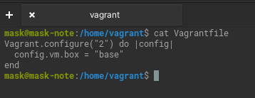
    
   * Выполнение в этой директории `vagrant up` установит провайдер VirtualBox для Vagrant, скачает необходимый образ и запустит виртуальную машину.

      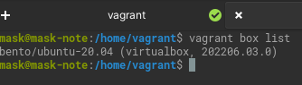
      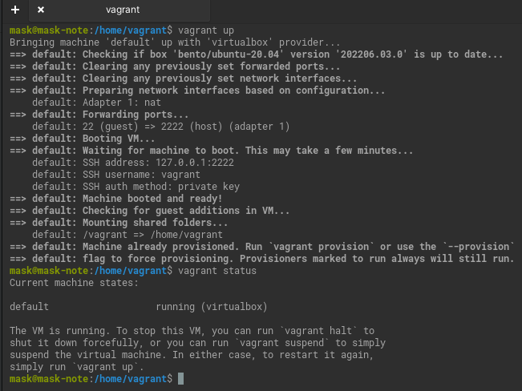

   * `vagrant suspend` выключит виртуальную машину с сохранением ее состояния (т.е., при следующем `vagrant up` будут запущены все процессы внутри, которые работали на момент вызова suspend), `vagrant halt` выключит виртуальную машину штатным образом.*

      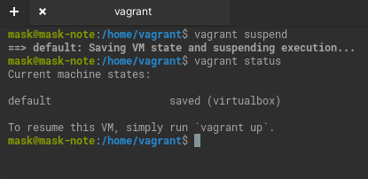
       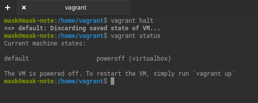

1. Ознакомьтесь с графическим интерфейсом VirtualBox, посмотрите как выглядит виртуальная машина, которую создал для вас Vagrant, какие аппаратные ресурсы ей выделены. Какие ресурсы выделены по-умолчанию?
    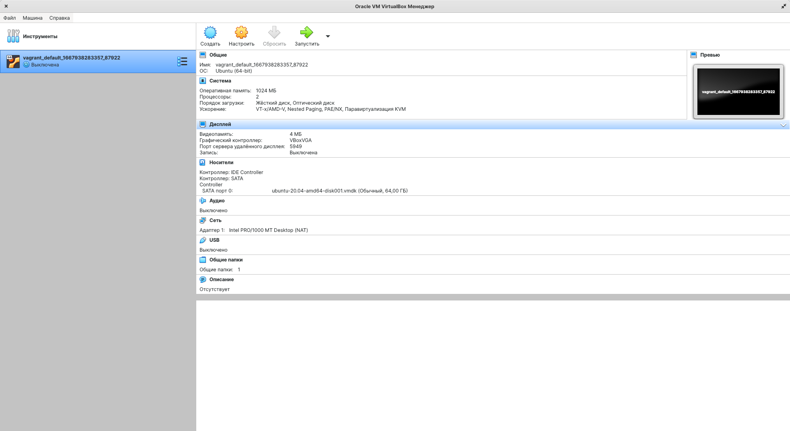

1. Ознакомьтесь с возможностями конфигурации VirtualBox через Vagrantfile: [документация](https://www.vagrantup.com/docs/providers/virtualbox/configuration.html). Как добавить оперативной памяти или ресурсов процессора виртуальной машине?
         
   Изменением следующих параметров.     
      ```
      config.vm.provider "virtualbox" do |vb|
         vb.memory = "1024"
         vb.cpus = 2
      end
      ```

1. Команда `vagrant ssh` из директории, в которой содержится Vagrantfile, позволит вам оказаться внутри виртуальной машины без каких-либо дополнительных настроек. Попрактикуйтесь в выполнении обсуждаемых команд в терминале Ubuntu.
   
   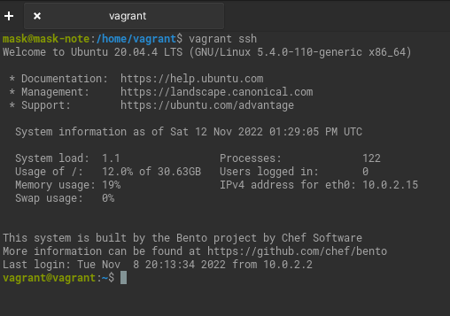
1. Ознакомьтесь с разделами `man bash`, почитайте о настройках самого bash:
    * какой переменной можно задать длину журнала `history`, и на какой строчке manual это описывается?
   
       На 793 странице  HISTFILESIZE. 
       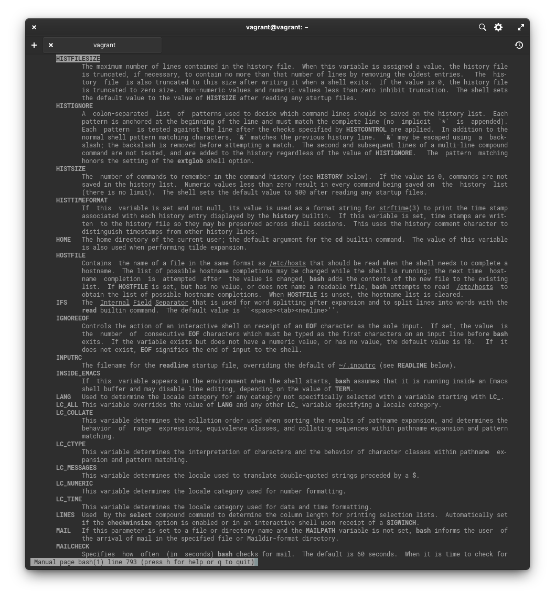
   
    * что делает директива `ignoreboth` в bash?
       
       Не сохраняет в списке истории строки, начинающиеся с символа пробела или соответствующие предыдущей записи истории.
          
1. В каких сценариях использования применимы скобки `{}` и на какой строчке `man bash` это описано?

   Строка 245. Составная команда - список.  Список просто выполняется в текущей среде оболочки. Cписок должен заканчиваться новой строкой или точкой с запятой. Это известно как групповая команда. Статус возврата - это статус выхода из списка. Может использоваться при определении функции.
   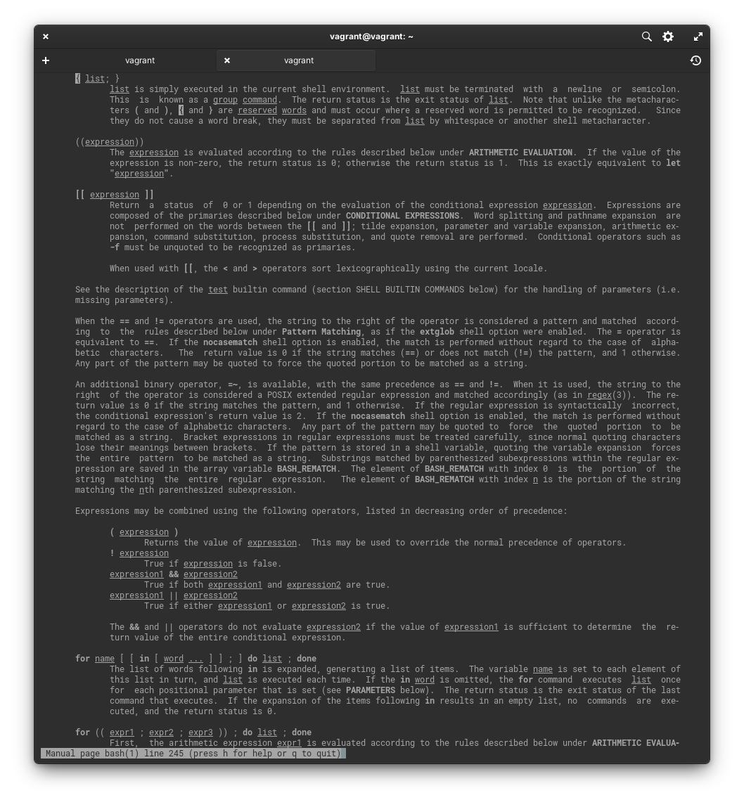
   Строка 1020. Расширение фигурных скобок - это механизм, с помощью которого могут быть сгенерированы произвольные строки.
   Он аналогичен подстановке имен файлов, но генерируемые имена не обязательно должны существовать.
   Шаблоны в фигурных скобках имеют вид необязательного префикса, за которым идет набор строк через запятую в фигурных скобках, после чего - необязательный суффикс.
   Префикс добавляется в начало каждой строки, содержащейся в фигурных скобках, а затем к каждой полученной так (слева направо) строке добавляется суффикс.
   Выражения в фигурных скобках могут быть вложенными. Результаты каждой замены не сортируются; порядок слева направо сохраняется.
   Например, конструкция a{d,c,b}e заменяется на 'ade ace abe'.
   Замена выражений в фигурных скобках выполняется перед любыми другими заменами, и в результате сохраняются все символы, имеющие специальное значение для других замен. 
   Эта замена - строго текстуальная.
   Командный интерпретатор bash никак не учитывает контекст подстановки или текст в фигурных скобках.
   Корректное выражение в фигурных скобках должно содержать незамаскированные
   открывающую и закрывающую фигурную скобку и, по крайней мере, одну незамаскированную
   запятую. Любое некорректное выражение в фигурных скобках остается неизменным.
   Символ { или , может маскироваться обратной косой для предотвращения его
   интерпретации на этапе замены выражений в фигурных скобках.
   Эта конструкция обычно используется для сокращенной записи группы строк с
   общим префиксом, более длинным чем в представленном выше примере:

   ```mkdir /usr/local/src/bash/{old,new,dist,bugs}```
 
   или

   ```chown root /usr/{ucb/{ex,edit},lib/{ex?.?*,how_ex}}```
   
   Выражение последовательности принимает форму ```{x..y[..incr]}```, где x и y — либо целые числа, либо одиночные символы, а incr, необязательное приращение, является целым числом.
   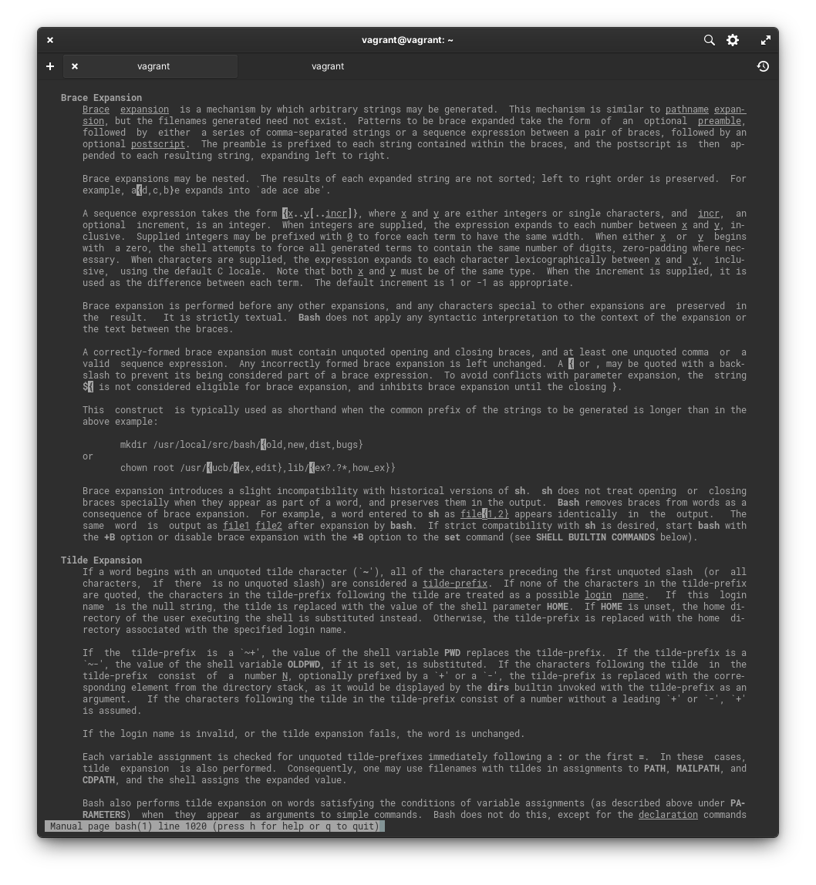

1. С учётом ответа на предыдущий вопрос, как создать однократным вызовом `touch` 100000 файлов? Получится ли аналогичным образом создать 300000? Если нет, то почему?
   
   ```touch tmpfile{1..100000}```
   300000 создать не получится. Слишком длинный список аргументов. Ограничен переменной ARG_MAX.
   
   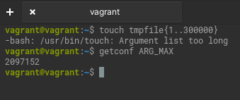
1. В man bash поищите по `/\[\[`. Что делает конструкция `[[ -d /tmp ]]`
   
   Возвращает значение TRUE , если файл существует и является директорией.

   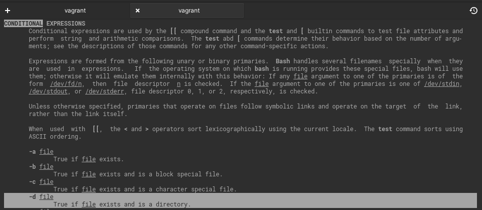
   Дополнительный вопрос. Что же вернется в нашем случае? 0 или 1?

   Ответ: 0, если существует и  является директорией.
   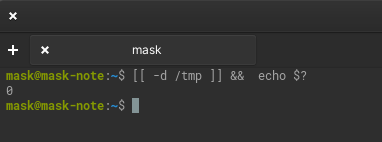
   
         
1. Сделайте так, чтобы в выводе команды `type -a bash` первым стояла запись с нестандартным путем, например bash is ... 
Используйте знания о просмотре существующих и создании новых переменных окружения, обратите внимание на переменную окружения PATH 

	```bash
	bash is /tmp/new_path_directory/bash
	bash is /usr/local/bin/bash
	bash is /bin/bash
	```

	(прочие строки могут отличаться содержимым и порядком)
    В качестве ответа приведите команды, которые позволили вам добиться указанного вывода или соответствующие скриншоты.
    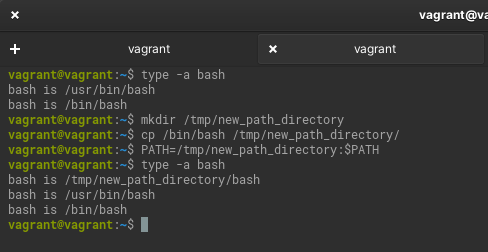
1. Чем отличается планирование команд с помощью `batch` и `at`?
   
   at выполняет команду в назначенное время.
   
   batch выполняет команды, когда позволяет уровень загрузки системы. 
   Другими словами, когда средний уровень загрузки ниже 1.5 или другого значения заданного при вызове atd.
   
   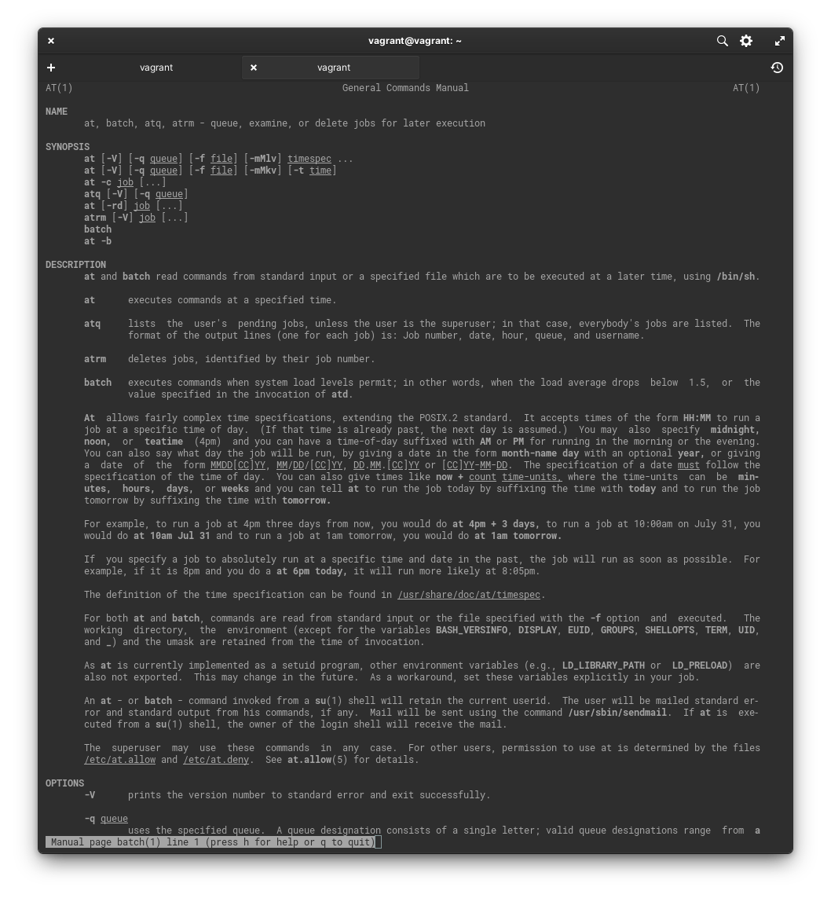
1. Завершите работу виртуальной машины чтобы не расходовать ресурсы компьютера и/или батарею ноутбука.
   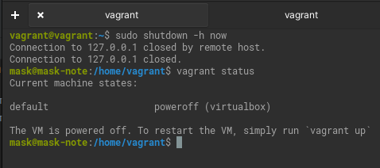
 

