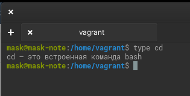
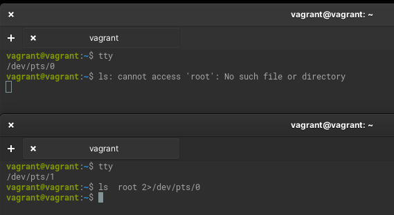
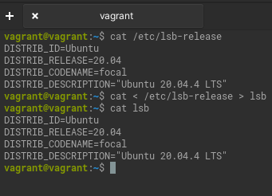
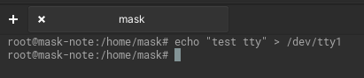
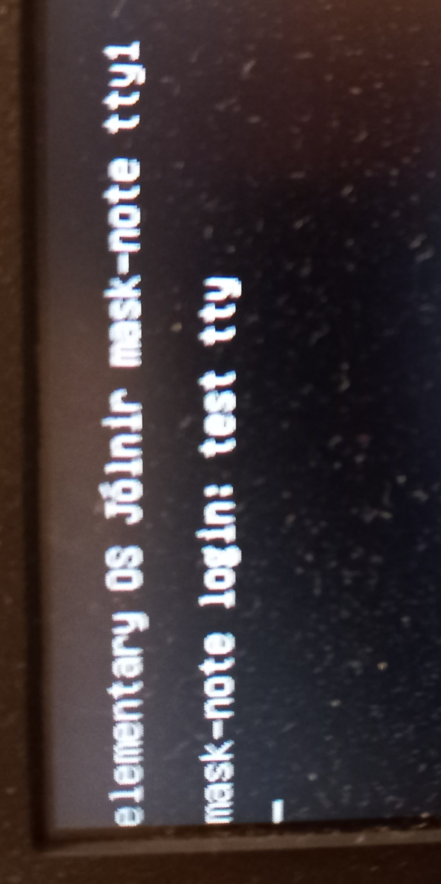
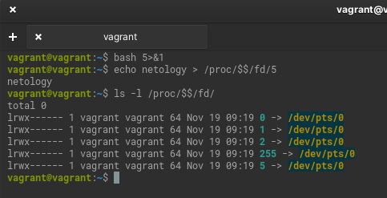
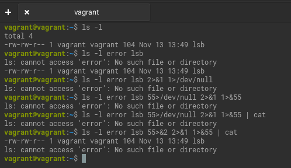
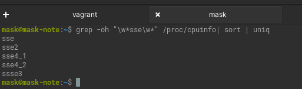
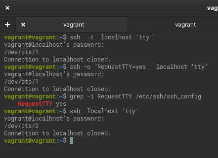
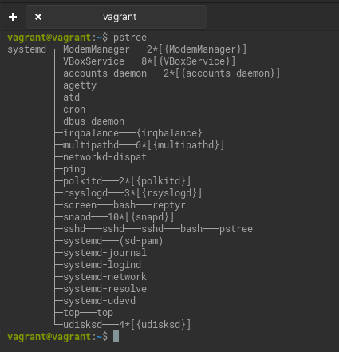

# Домашнее задание к занятию "3.2. Работа в терминале. Лекция 2"

### Инструменты/ дополнительные материалы, которые пригодятся для выполнения задания

[Статья с примерами перенаправлений в Bash и работы с файловыми дескрипторами](https://wiki.bash-hackers.org/howto/redirection_tutorial)


------

## Задание

1. Какого типа команда `cd`? Попробуйте объяснить, почему она именно такого типа: опишите ход своих мыслей, если считаете, что она могла бы быть другого типа.
   
   type сообщает, что cd — это встроенная команда bash. Сложно представить её невстроенной.
   Так как предназначена для смены текущего рабочего каталога.

   

1. Какая альтернатива без pipe команде `grep <some_string> <some_file> | wc -l`?   

	<details>
	<summary>Подсказка</summary>

	`man grep` поможет в ответе на этот вопрос. 

	</details>
	
	Ознакомьтесь с [документом](http://www.smallo.ruhr.de/award.html) о других подобных некорректных вариантах использования pipe.

   `grep -c <some_string> <some_file> `
1. Какой процесс с PID `1` является родителем для всех процессов в вашей виртуальной машине Ubuntu 20.04?
	
   ```lsof -p 1``` и ```pstree``` сообщают, что это systemd. ```man systemd``` - systemd - это системный менеджер и менеджер служб для операционных систем Linux. При запуске в качестве первого процесса при загрузке (как PID 1) он действует
как система инициализации, которая запускает и поддерживает службы пользовательского пространства.  
1. Как будет выглядеть команда, которая перенаправит вывод stderr `ls` на другую сессию терминала?
   
   
1. Получится ли одновременно передать команде файл на stdin и вывести ее stdout в другой файл? Приведите работающий пример.

   
1. Получится ли, находясь в графическом режиме, вывести данные из PTY в какой-либо из эмуляторов TTY? Сможете ли вы наблюдать выводимые данные?
   
   Да, получится.
   
   
   
   Переключамся на tty1 (ctrl-alt-F1). И видим.
   
   
   
1. Выполните команду `bash 5>&1`. К чему она приведет? Что будет, если вы выполните `echo netology > /proc/$$/fd/5`? Почему так происходит?

   Запустит новый экземпляр bash с дополнительным файловым дескриптором 5, перенаправленным на стандартный выход.
   Выведет `netology`. Так как вывод `echo` перенаправлен в файловый дескриптор 5 оболочки, который перенаправлен на её (оболочки) стандарный выход.
   Для наглядности.

   

1. Получится ли в качестве входного потока для pipe использовать только stderr команды, не потеряв при этом отображение stdout на pty?  
	Напоминаем: по умолчанию через pipe передается только stdout команды слева от `|` на stdin команды справа.
Это можно сделать, поменяв стандартные потоки местами через промежуточный новый дескриптор, который вы научились создавать в предыдущем вопросе.
   Например ``ls -l error lsb 55>&2 2>&1 1>&55 | cat``. Где файл lsb существует, а error нет. Логика на скриншоте.
  
    
   
1. Что выведет команда `cat /proc/$$/environ`? Как еще можно получить аналогичный по содержанию вывод?

   Покажет переменные окружения, заданные на этапе запуска процесса. Записи разделены нулевыми байтами ('\0'), и в конце может быть нулевой байт.
   Для нормального (построчного) отображения лучше использовать ```cat /proc/$$/environ | tr '\000' '\n'```.
   Если никаких переменных больше не экспортировалось, то ```env -0``` и ```printenv -0```, которые без ```-0``` покажут переменные построчно.
1. Используя `man`, опишите что доступно по адресам `/proc/<PID>/cmdline`, `/proc/<PID>/exe`.
   
   `/proc/<PID>/cmdline` показывает полный путь исполняемого процесса. Если процесс является зомби, то файл пустой.

   `/proc/<PID>/exe`
   
   В Linux 2.2 и более поздних версиях этот файл представляет собой символическую ссылку, содержащую фактический путь к выполняемой команде.

   В Linux 2.0 и более ранних версиях /proc/[pid]/exe является указателем на двоичный файл, который был выполнен, и отображается как символическая ссылка. 
   Вызов readlink(2) для этого файла в Linux 2.0 возвращает строку в формате: ```[device]:inode```
1. Узнайте, какую наиболее старшую версию набора инструкций SSE поддерживает ваш процессор с помощью `/proc/cpuinfo`.

   SSE4_2

   
1. При открытии нового окна терминала и `vagrant ssh` создается новая сессия и выделяется pty.  
	Это можно подтвердить командой `tty`, которая упоминалась в лекции 3.2.  
	Однако:

    ```bash
	vagrant@netology1:~$ ssh localhost 'tty'
	not a tty
    ```

	Почитайте, почему так происходит, и как изменить поведение.

   Это происходит потому, что ssh клиент по умолчанию не запрашивает псевдо-терминал.
   Исправить можно 3 способами:
   - ```ssh -t localhost 'tty'```
   - ```ssh -o "RequestTTY=yes"  localhost 'tty' ```
   - Добавить в /etc/ssh/ssh_config параметр ```RequestTTY yes```
   
   
1. Бывает, что есть необходимость переместить запущенный процесс из одной сессии в другую. Попробуйте сделать это, воспользовавшись `reptyr`. Например, так можно перенести в `screen` процесс, который вы запустили по ошибке в обычной SSH-сессии.
   
   

   Делал по [инструкциям](https://github.com/nelhage/reptyr#typical-usage-pattern).
1. `sudo echo string > /root/new_file` не даст выполнить перенаправление под обычным пользователем, так как перенаправлением занимается процесс shell'а, который запущен без `sudo` под вашим пользователем. Для решения данной проблемы можно использовать конструкцию `echo string | sudo tee /root/new_file`. Узнайте? что делает команда `tee` и почему в отличие от `sudo echo` команда с `sudo tee` будет работать.

   ```tee``` читает стандартный вход и пишет его в стандартный выход и файлы.
   `echo string | sudo tee /root/new_file` будет работать так как, непосредственно `tee` получает повышенные привилегии.
   В отличие от ситуации с тем когда, перенаправлением занимается непревилигированный shell.