# Домашнее задание к занятию "3.4. Операционные системы. Лекция 2"

### Цель задания

В результате выполнения этого задания вы:
1. Ознакомитесь со средством сбора метрик node_exporter и средством сбора и визуализации метрик NetData. Такого рода инструменты позволяют выстроить систему мониторинга сервисов для своевременного выявления проблем в их работе.
2. Построите простой systemd unit файл для создания долгоживущих процессов, которые стартуют вместе со стартом системы автоматически.
3. Проанализируете dmesg, а именно часть лога старта виртуальной машины, чтобы понять, какая полезная информация может там находиться.
4. Поработаете с unshare и nsenter для понимания, как создать отдельный namespace для процесса (частичная контейнеризация).

### Чеклист готовности к домашнему заданию

1. Убедитесь, что у вас установлен [Netdata](https://github.com/netdata/netdata) c ресурса с предподготовленными [пакетами](https://packagecloud.io/netdata/netdata/install) или `sudo apt install -y netdata`.


### Инструкция к заданию

1. Создайте .md-файл для ответов на задания в своём репозитории, после выполнения прикрепите ссылку на него в личном кабинете.
2. Любые вопросы по решению задач задавайте в чате учебной группы.

------

### Инструменты/ дополнительные материалы, которые пригодятся для выполнения задания

1. [Документация](https://www.freedesktop.org/software/systemd/man/systemd.service.html) по systemd unit файлам
2. [Документация](https://www.kernel.org/doc/Documentation/sysctl/) по параметрам sysctl

------

## Задание

1. На лекции мы познакомились с [node_exporter](https://github.com/prometheus/node_exporter/releases). В демонстрации его исполняемый файл запускался в background. Этого достаточно для демо, но не для настоящей production-системы, где процессы должны находиться под внешним управлением. Используя знания из лекции по systemd, создайте самостоятельно простой [unit-файл](https://www.freedesktop.org/software/systemd/man/systemd.service.html) для node_exporter:
    * Установка 
    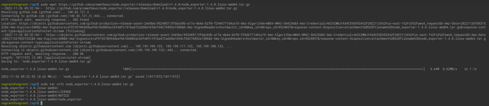
   
    * поместите его в автозагрузку,
     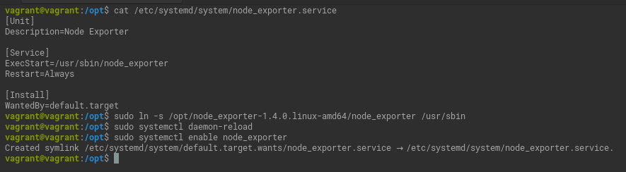
    * предусмотрите возможность добавления опций к запускаемому процессу через внешний файл (посмотрите, например, на `systemctl cat cron`),
    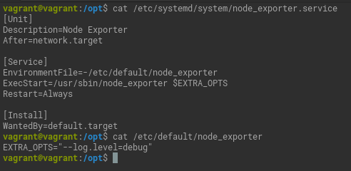
    * удостоверьтесь, что с помощью systemctl процесс корректно стартует, завершается, а после перезагрузки автоматически поднимается.
     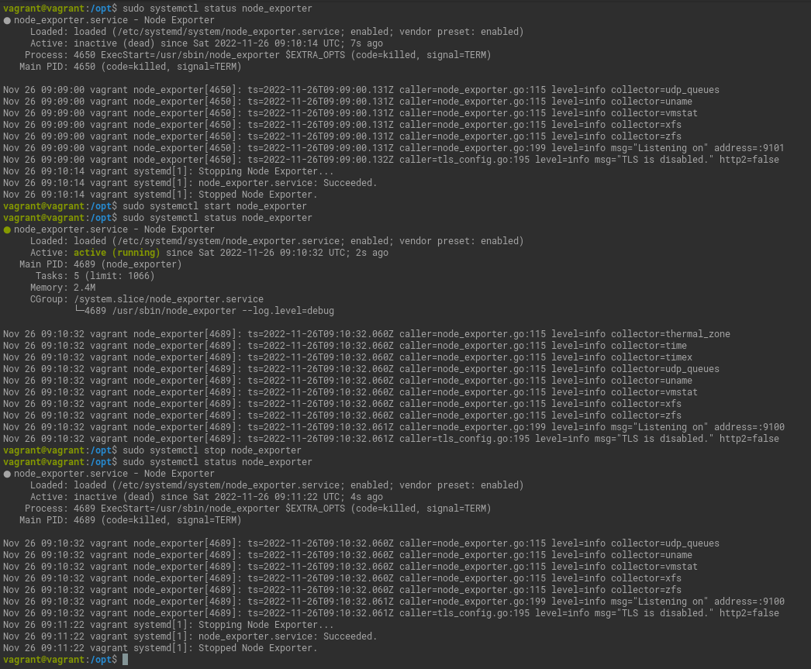
    
     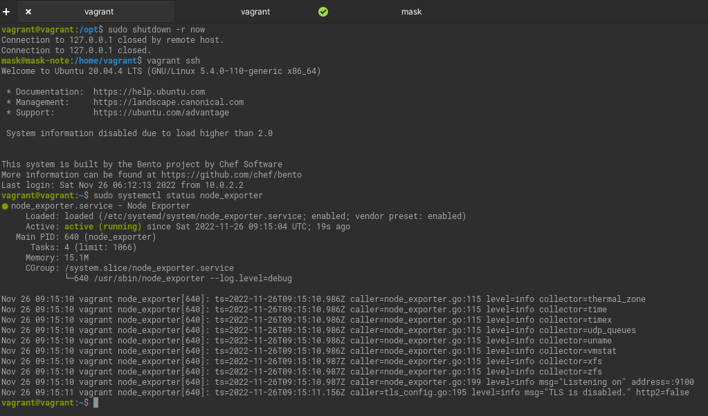
1. Ознакомьтесь с опциями node_exporter и выводом `/metrics` по-умолчанию. Приведите несколько опций, которые вы бы выбрали для базового мониторинга хоста по CPU, памяти, диску и сети.
   
   `node_cpu_seconds_total` 
   * `idle` время простоя процессора.
   * `iowait` покажет проблемы с вводом-выводом (диски, сеть).
   * `steal` количество времени "украденного" другими виртуальными машинами.
   * `system` время потраченное ядром.
   * `user` время проведенное в пользовательском окружении.
   
   `node_memory_MemAvailable_bytes` количество используемой памяти.

   `node_memory_MemTotal_bytes` объем памяти.

   `node_memory_MemFree_bytes` количество свободной памяти.
    
   `node_memory_SwapFree_bytes` количество свободной памяти кеша.

   `node_memory_SwapTotal_bytes` объём кеша.

   `node_disk_read_bytes_total` чтение с диска.

   `node_disk_written_bytes_total` запись на диск.

   `node_filesystem_avail_bytes` занято в файловой системе.

   `node_filesystem_size_bytes` размер файловой системы.

   `node_filesystem_device_error` ошибки при получении статистики.

   `node_network_receive_errs_total` ошибки получения.

   `node_network_transmit_errs_total` ошибки отправки.

   `node_network_transmit_packets_total` количество переданных пакетов.

   `node_network_receive_packets_total`  количество полученных пакетов.
   
   `node_network_info` общая информация об интерфейсе.

1. Установите в свою виртуальную машину [Netdata](https://github.com/netdata/netdata). Воспользуйтесь [готовыми пакетами](https://packagecloud.io/netdata/netdata/install) для установки (`sudo apt install -y netdata`). 
   
   После успешной установки:
    * в конфигурационном файле `/etc/netdata/netdata.conf` в секции [web] замените значение с localhost на `bind to = 0.0.0.0`,
    * добавьте в Vagrantfile проброс порта Netdata на свой локальный компьютер и сделайте `vagrant reload`:

    ```bash
    config.vm.network "forwarded_port", guest: 19999, host: 19999
    ```

    После успешной перезагрузки в браузере *на своем ПК* (не в виртуальной машине) вы должны суметь зайти на `localhost:19999`. Ознакомьтесь с метриками, которые по умолчанию собираются Netdata и с комментариями, которые даны к этим метрикам.
    
   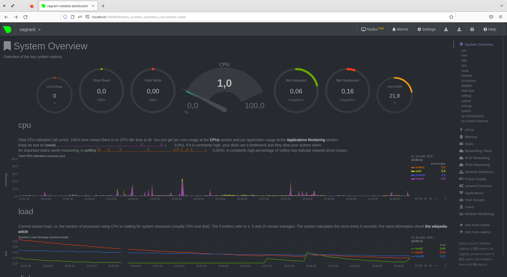

1. Можно ли по выводу `dmesg` понять, осознает ли ОС, что загружена не на настоящем оборудовании, а на системе виртуализации?
   
   Да, можно.
   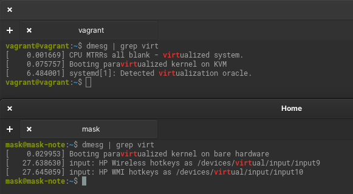
   
1. Как настроен sysctl `fs.nr_open` на системе по-умолчанию? Определите, что означает этот параметр. Какой другой существующий лимит не позволит достичь такого числа (`ulimit --help`)?

   Это значение, на единицу превышающее максимальное число файловых дескрипторов, которое может быть открыто этим процессом (ядром).
   Значение по умолчанию в этом файле — 1048576.
   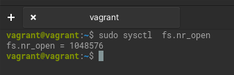
   
   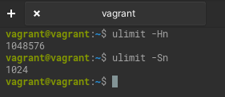 
   
   "Мягкое" ограничение на количество открытых дескрипторов. `ulimit -Sn`  
1. Запустите любой долгоживущий процесс (не `ls`, который отработает мгновенно, а, например, `sleep 1h`) в отдельном неймспейсе процессов; покажите, что ваш процесс работает под PID 1 через `nsenter`. Для простоты работайте в данном задании под root (`sudo -i`). Под обычным пользователем требуются дополнительные опции (`--map-root-user`) и т.д.
   
   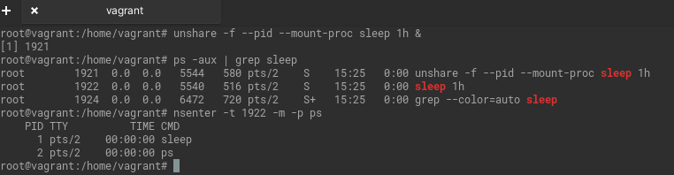

1. Найдите информацию о том, что такое `:(){ :|:& };:`. Запустите эту команду в своей виртуальной машине Vagrant с Ubuntu 20.04 (**это важно, поведение в других ОС не проверялось**). Некоторое время все будет "плохо", после чего (минуты) – ОС должна стабилизироваться. Вызов `dmesg` расскажет, какой механизм помог автоматической стабилизации.  
Как настроен этот механизм по-умолчанию, и как изменить число процессов, которое можно создать в сессии?
   
   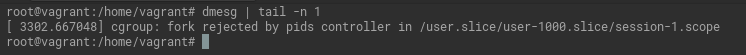
   
   Настройки по умолчанию можно посмотреть командами `ulimit -u` и `ulimit -uH`.
   Изменить можно в меньшую сторону командой `ulimit -u X` где X - максимальное количество пользовательских процессов.
   Или изменением конфига `/etc/security/limits.conf`. Item - nproc - max number of processes.


*В качестве решения ответьте на вопросы и опишите каким образом эти ответы были получены*

----

### Правила приема домашнего задания

В личном кабинете отправлена ссылка на .md файл в вашем репозитории.

-----

### Критерии оценки

Зачет - выполнены все задания, ответы даны в развернутой форме, приложены соответствующие скриншоты и файлы проекта, в выполненных заданиях нет противоречий и нарушения логики.

На доработку - задание выполнено частично или не выполнено, в логике выполнения заданий есть противоречия, существенные недостатки. 
 
