# Домашнее задание к занятию "3.5. Файловые системы"

### Цель задания

В результате выполнения этого задания вы: 

1. Научитесь работать с инструментами разметки жестких дисков, виртуальных разделов - RAID массивами и логическими томами, конфигурациями файловых систем. Основная задача - понять, какие слои абстракций могут нас отделять от файловой системы до железа. Обычно инженер инфраструктуры не сталкивается напрямую с настройкой LVM или RAID, но иметь понимание, как это работает - необходимо.
1. Создадите нештатную ситуацию работы жестких дисков и поймете, как система RAID обеспечивает отказоустойчивую работу.

------

### Чеклист готовности к домашнему заданию

1. Убедитесь, что у вас на новой виртуальной машине (шаг 3 задания) установлены следующие утилиты - `mdadm`, `fdisk`, `sfdisk`, `mkfs`, `lsblk`, `wget`.  
2. Воспользуйтесь пакетным менеджером apt для установки необходимых инструментов


### Инструменты/ дополнительные материалы, которые пригодятся для выполнения задания

1. Разряженные файлы - [sparse](https://ru.wikipedia.org/wiki/%D0%A0%D0%B0%D0%B7%D1%80%D0%B5%D0%B6%D1%91%D0%BD%D0%BD%D1%8B%D0%B9_%D1%84%D0%B0%D0%B9%D0%BB)
2. [Подробный анализ производительности RAID,3-19 страницы](https://www.baarf.dk/BAARF/0.Millsap1996.08.21-VLDB.pdf).
3. [RAID5 write hole](https://www.intel.com/content/www/us/en/support/articles/000057368/memory-and-storage.html).


------

## Задание

1. Узнайте о [sparse](https://ru.wikipedia.org/wiki/%D0%A0%D0%B0%D0%B7%D1%80%D0%B5%D0%B6%D1%91%D0%BD%D0%BD%D1%8B%D0%B9_%D1%84%D0%B0%D0%B9%D0%BB) (разряженных) файлах.
   
   Разреженные файлы являются специальным форматом представления, в котором часть цифровой последовательности заменена сведениями о ней (сформирован перечень дыр), что в свою очередь позволяет гораздо эффективнее задействовать возможности файловой системы. Информация об отсутствующих последовательностях располагается напрямую в метаданных файловой системы, а не занятый высвободившийся объем запоминающего устройства будет использоваться для записи по мере надобности. Такой подход значительно сокращает объем исходного файла и экономит пространство накопителя.
      
1. Могут ли файлы, являющиеся жесткой ссылкой на один объект, иметь разные права доступа и владельца? Почему?

   Нет. Оба файла будут использовать одну и ту же структуру inode, поэтому они в любом случае будут иметь одни и те же права доступа, а также одного и того же владельца.

1. Сделайте `vagrant destroy` на имеющийся инстанс Ubuntu. Замените содержимое Vagrantfile следующим:

    ```ruby
    path_to_disk_folder = './disks'

    host_params = {
        'disk_size' => 2560,
        'disks'=>[1, 2],
        'cpus'=>2,
        'memory'=>2048,
        'hostname'=>'sysadm-fs',
        'vm_name'=>'sysadm-fs'
    }
    Vagrant.configure("2") do |config|
        config.vm.box = "bento/ubuntu-20.04"
        config.vm.hostname=host_params['hostname']
        config.vm.provider :virtualbox do |v|

            v.name=host_params['vm_name']
            v.cpus=host_params['cpus']
            v.memory=host_params['memory']

            host_params['disks'].each do |disk|
                file_to_disk=path_to_disk_folder+'/disk'+disk.to_s+'.vdi'
                unless File.exist?(file_to_disk)
                    v.customize ['createmedium', '--filename', file_to_disk, '--size', host_params['disk_size']]
                end
                v.customize ['storageattach', :id, '--storagectl', 'SATA Controller', '--port', disk.to_s, '--device', 0, '--type', 'hdd', '--medium', file_to_disk]
            end
        end
        config.vm.network "private_network", type: "dhcp"
    end
    ```

    Данная конфигурация создаст новую виртуальную машину с двумя дополнительными неразмеченными дисками по 2.5 Гб.

1. Используя `fdisk`, разбейте первый диск на 2 раздела: 2 Гб, оставшееся пространство.

   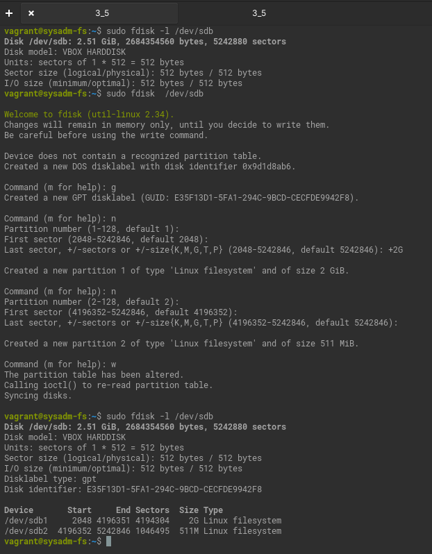
   
1. Используя `sfdisk`, перенесите данную таблицу разделов на второй диск.

   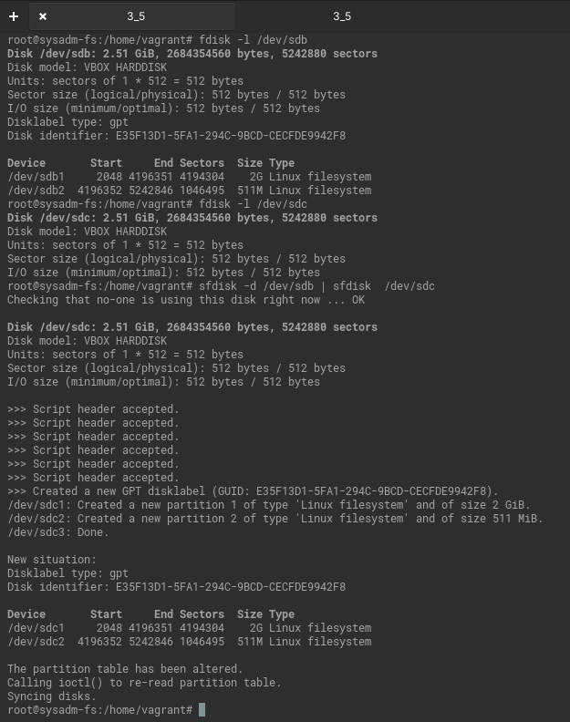

1. Соберите `mdadm` RAID1 на паре разделов 2 Гб.

   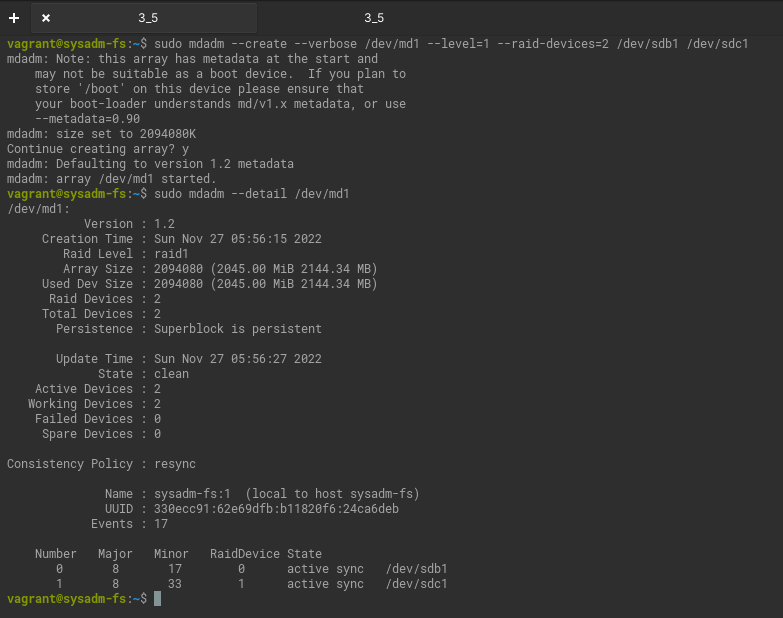

1. Соберите `mdadm` RAID0 на второй паре маленьких разделов.

   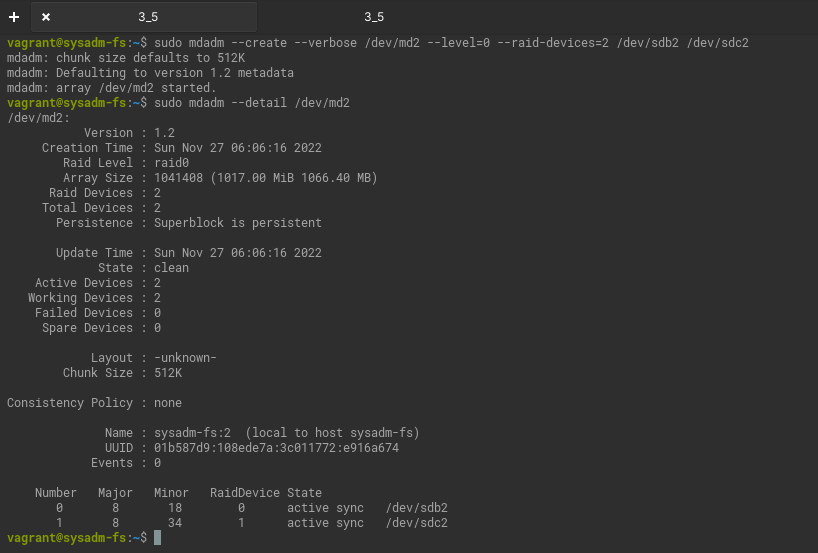

   Сохраним настройки в mdadm.conf

   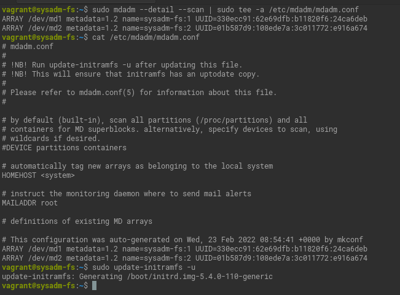

1. Создайте 2 независимых PV на получившихся md-устройствах.

   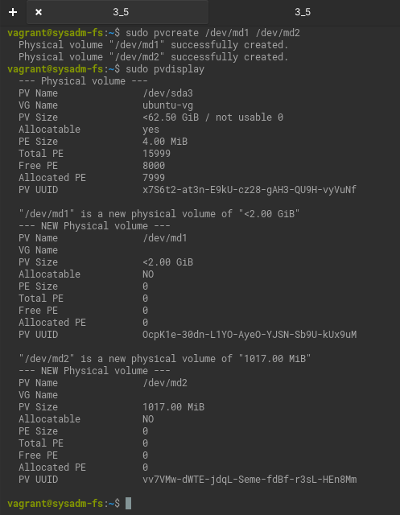

1. Создайте общую volume-group на этих двух PV.

   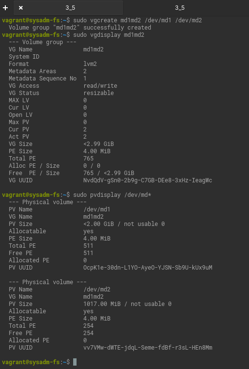

1. Создайте LV размером 100 Мб, указав его расположение на PV с RAID0.

   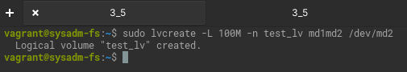

1. Создайте `mkfs.ext4` ФС на получившемся LV.

   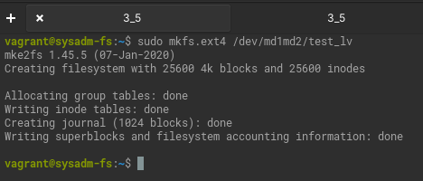

1. Смонтируйте этот раздел в любую директорию, например, `/tmp/new`.

   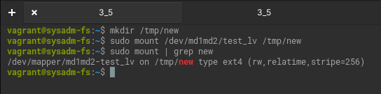

1. Поместите туда тестовый файл, например `wget https://mirror.yandex.ru/ubuntu/ls-lR.gz -O /tmp/new/test.gz`.

   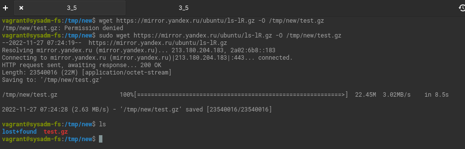

1. Прикрепите вывод `lsblk`.

   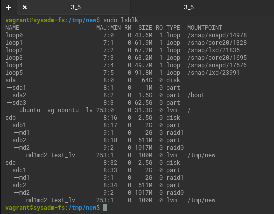  
  
1. Протестируйте целостность файла:

    ```bash
    root@vagrant:~# gzip -t /tmp/new/test.gz
    root@vagrant:~# echo $?
    0
    ```

   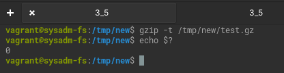
1. Используя pvmove, переместите содержимое PV с RAID0 на RAID1.

   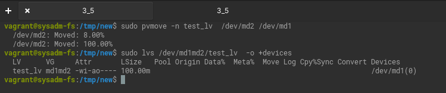

1. Сделайте `--fail` на устройство в вашем RAID1 md.

   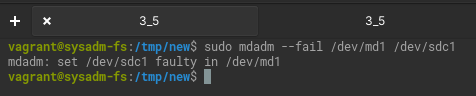

1. Подтвердите выводом `dmesg`, что RAID1 работает в деградированном состоянии.

   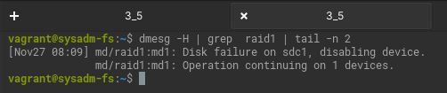

1. Протестируйте целостность файла, несмотря на "сбойный" диск он должен продолжать быть доступен:

    ```bash
    root@vagrant:~# gzip -t /tmp/new/test.gz
    root@vagrant:~# echo $?
    0
    ```

   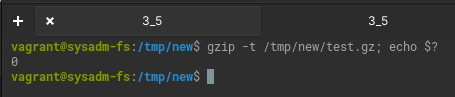
    
1. Погасите тестовый хост, `vagrant destroy`.
 
*В качестве решения ответьте на вопросы и опишите, каким образом эти ответы были получены*

----

### Правила приема домашнего задания

В личном кабинете отправлена ссылка на .md файл в вашем репозитории.


### Критерии оценки

Зачет - выполнены все задания, ответы даны в развернутой форме, приложены соответствующие скриншоты и файлы проекта, в выполненных заданиях нет противоречий и нарушения логики.

На доработку - задание выполнено частично или не выполнено, в логике выполнения заданий есть противоречия, существенные недостатки. 
 

