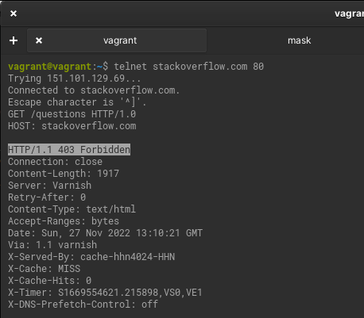
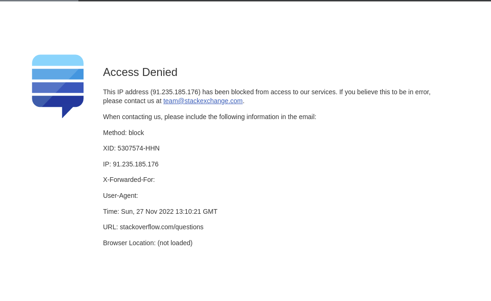
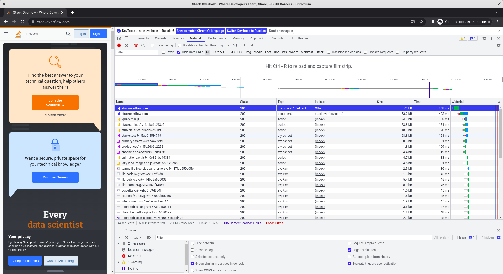
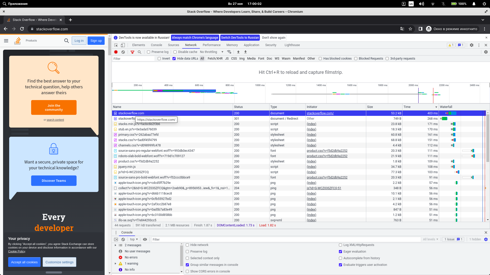
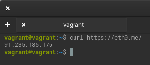
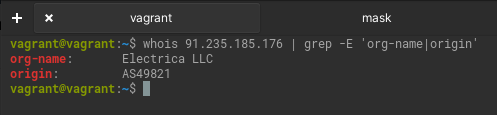
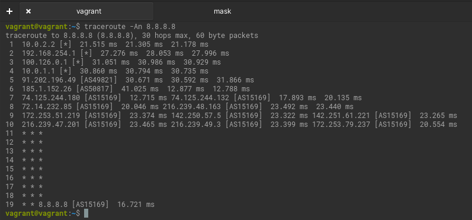
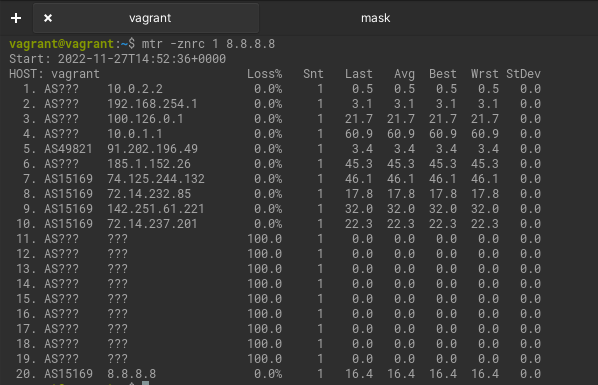
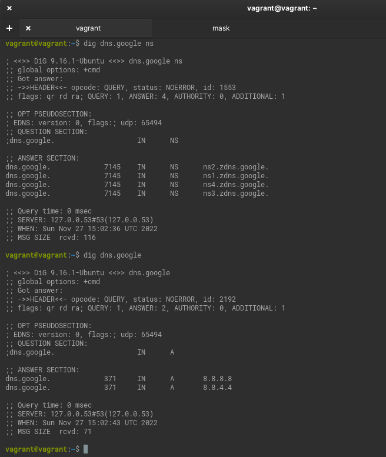
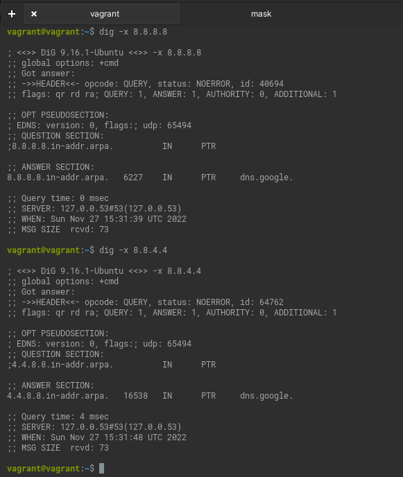

# Домашнее задание к занятию "3.6. Компьютерные сети. Лекция 1"

### Цель задания

В результате выполнения этого задания вы: 

1. Научитесь работать с http запросами, чтобы увидеть, как клиенты взаимодействуют с серверами по этому протоколу
2. Поработаете с сетевыми утилитами, чтобы разобраться, как их можно использовать для отладки сетевых запросов, соединений.

### Чеклист готовности к домашнему заданию

1. Убедитесь, что у вас установлены необходимые сетевые утилиты - dig, traceroute, mtr, telnet.
2. Используйте `apt install` для установки пакетов


### Инструкция к заданию

1. Создайте .md-файл для ответов на задания в своём репозитории, после выполнения, прикрепите ссылку на него в личном кабинете.
2. Любые вопросы по выполнению заданий спрашивайте в чате учебной группы и/или в разделе “Вопросы по заданию” в личном кабинете.


### Инструменты/ дополнительные материалы, которые пригодятся для выполнения задания

1. Полезным дополнением к обозначенным выше утилитам будет пакет net-tools. Установить его можно с помощью команды `apt install net-tools`.
2. RFC протокола HTTP/1.0, в частности [страница с кодами ответа](https://www.rfc-editor.org/rfc/rfc1945#page-32).
3. [Ссылки на остальные RFC для HTTP](https://blog.cloudflare.com/cloudflare-view-http3-usage/).

------

## Задание

1. Работа c HTTP через телнет.
- Подключитесь утилитой телнет к сайту stackoverflow.com
`telnet stackoverflow.com 80`
- Отправьте HTTP запрос
```bash
GET /questions HTTP/1.0
HOST: stackoverflow.com
[press enter]
[press enter]
```

*В ответе укажите полученный HTTP код, что он означает?*

`403 Forbidden`





Доступ к запрошенному ресурсу запрещен.
 Сервер понял запрос, но отказывается его выполнять.
 Авторизация не поможет, и запрос не следует повторять.
 Если метод запроса не был HEAD и сервер желает
обнародовать, почему запрос не был выполнен, он должен описать
причину отказа в теле сущности. Этот код состояния
обычно используется, когда сервер не желает раскрывать точную причину
отклонения запроса или когда другой ответ
не применим.


2. Повторите задание 1 в браузере, используя консоль разработчика F12.
- откройте вкладку `Network`
- отправьте запрос http://stackoverflow.com
- найдите первый ответ HTTP сервера, откройте вкладку `Headers`
- укажите в ответе полученный HTTP код

  `301 Moved Permanently`
   
   

- проверьте время загрузки страницы, какой запрос обрабатывался дольше всего?
  
  268 ms выполнялся первый запрос по http. Верхний на предыдушем скриншоте.

  Второй запрос выполнялся дольше всего 403 ms - как раз когда происходила загрузка страницы  по https.

- приложите скриншот консоли браузера в ответ.
  
  

3. Какой IP адрес у вас в интернете?
   
    

4. Какому провайдеру принадлежит ваш IP адрес? Какой автономной системе AS? Воспользуйтесь утилитой `whois`

   
   
5. Через какие сети проходит пакет, отправленный с вашего компьютера на адрес 8.8.8.8? Через какие AS? Воспользуйтесь утилитой `traceroute`

   

7. Повторите задание 5 в утилите `mtr`. На каком участке наибольшая задержка - delay?

   

  На 4 пинге учитывать надо колонку `Wrst`.
   
7. Какие DNS сервера отвечают за доменное имя dns.google? Какие A записи? Воспользуйтесь утилитой `dig`

   

8. Проверьте PTR записи для IP адресов из задания 7. Какое доменное имя привязано к IP? Воспользуйтесь утилитой `dig`
   
   

  `dns.google.`

*В качестве ответов на вопросы приложите лог выполнения команд в консоли или скриншот полученных результатов.*

----

### Правила приема домашнего задания

В личном кабинете отправлена ссылка на .md файл в вашем репозитории.


### Критерии оценки

Зачет - выполнены все задания, ответы даны в развернутой форме, приложены соответствующие скриншоты и файлы проекта, в выполненных заданиях нет противоречий и нарушения логики.

На доработку - задание выполнено частично или не выполнено, в логике выполнения заданий есть противоречия, существенные недостатки. 
----


