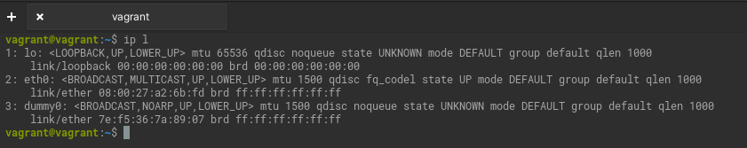
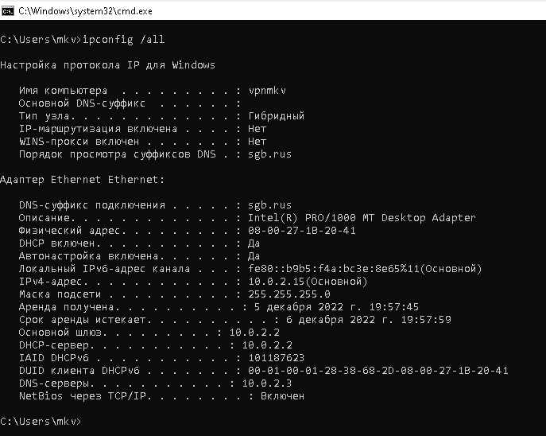
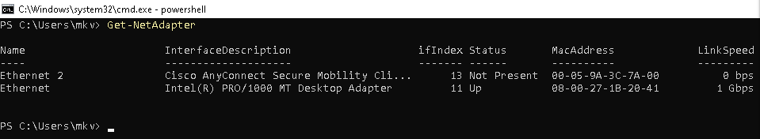
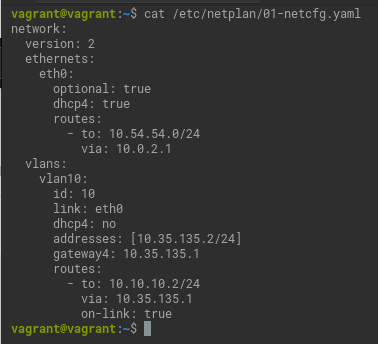
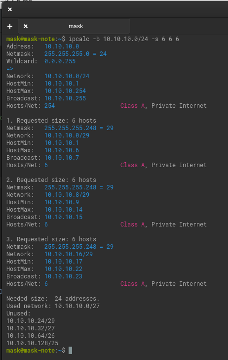
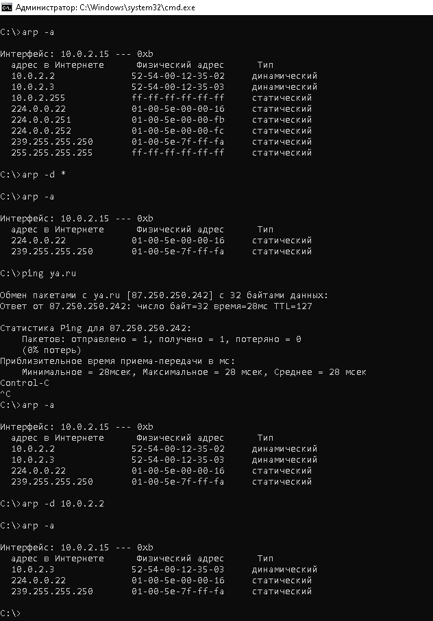

# Домашнее задание к занятию "3.7. Компьютерные сети.Лекция 2"

### Цель задания

В результате выполнения этого задания вы:

1. Познакомитесь с инструментами настройки сети в Linux, агрегации нескольких сетевых интерфейсов, отладки их работы.
2. Примените знания о сетевых адресах на практике для проектирования сети.


### Инструкция к заданию

1. Создайте .md-файл для ответов на задания в своём репозитории, после выполнения прикрепите ссылку на него в личном кабинете.
2. Любые вопросы по выполнению заданий спрашивайте в чате учебной группы и/или в разделе “Вопросы по заданию” в личном кабинете.


### Инструменты/ дополнительные материалы, которые пригодятся для выполнения задания

1. [Калькулятор сетей online](https://calculator.net/ip-subnet-calculator.html).
2. Калькулятор сетей программа - ipcalc (`apt install ipcalc`), если есть графический интерфейс, то у программы калькулятора есть инженерный режим, там можно и сети считать.


------

## Задание

1. Проверьте список доступных сетевых интерфейсов на вашем компьютере. Какие команды есть для этого в Linux и в Windows?
   
   `ip l`
    
   

   `ifconfig -a`

   

   `ipconfig /all`

   

   `Get-NetAdapter`

   

2. Какой протокол используется для распознавания соседа по сетевому интерфейсу? Какой пакет и команды есть в Linux для этого?

   `LLDP – протокол для обмена информацией между соседними устройствами,
    позволяет определить к какому порту коммутатора подключен сервер.`

   `lldpd`

    `lldpctl`

3. Какая технология используется для разделения L2 коммутатора на несколько виртуальных сетей? Какой пакет и команды есть в Linux для этого? Приведите пример конфига.

   `VLAN (аббр. от англ. Virtual Local Area Network) — виртуальная локальная компьютерная сеть. Представляет собой группу хостов с общим набором требований, которые взаимодействуют так, как если бы они были подключены к широковещательному домену независимо от их физического местонахождения. VLAN имеет те же свойства, что и физическая локальная сеть, но позволяет конечным членам группироваться вместе, даже если они не находятся в одной физической сети.`

   

4. Какие типы агрегации интерфейсов есть в Linux? 
   
   Cтатический и динамический.

   Какие опции есть для балансировки нагрузки?
   
   mode=0 (balance-rr)
   
   Этот режим используется по-умолчанию, если в настройках не указано другое. balance-rr обеспечивает балансировку нагрузки и отказоустойчивость. В данном режиме пакеты отправляются "по кругу" от первого интерфейса к последнему и сначала. Если выходит из строя один из интерфейсов, пакеты отправляются на остальные оставшиеся.При подключении портов к разным коммутаторам, требует их настройки.

   mode=1 (active-backup)

   При active-backup один интерфейс работает в активном режиме, остальные в ожидающем. Если активный падает, управление передается одному из ожидающих. Не требует поддержки данной функциональности от коммутатора.

   mode=2 (balance-xor)

   Передача пакетов распределяется между объединенными интерфейсами по формуле ((MAC-адрес источника) XOR (MAC-адрес получателя)) % число интерфейсов. Один и тот же интерфейс работает с определённым получателем. Режим даёт балансировку нагрузки и отказоустойчивость.

   mode=3 (broadcast)

   Происходит передача во все объединенные интерфейсы, обеспечивая отказоустойчивость.

   mode=4 (802.3ad)

   Это динамическое объединение портов. В данном режиме можно получить значительное увеличение пропускной способности как входящего так и исходящего трафика, используя все объединенные интерфейсы. Требует поддержки режима от коммутатора, а так же (иногда) дополнительную настройку коммутатора.

   mode=5 (balance-tlb)
   
   Адаптивная балансировка нагрузки. При balance-tlb входящий трафик получается только активным интерфейсом, исходящий - распределяется в зависимости от текущей загрузки каждого интерфейса. Обеспечивается отказоустойчивость и распределение нагрузки исходящего трафика. Не требует специальной поддержки коммутатора.

   mode=6 (balance-alb)

   Адаптивная балансировка нагрузки (более совершенная). Обеспечивает балансировку нагрузки как исходящего (TLB, transmit load balancing), так и входящего трафика (для IPv4 через ARP). Не требует специальной поддержки коммутатором, но требует возможности изменять MAC-адрес устройства.

   Приведите пример конфига.
   
   `active-backup`
```commandline
network:
  version: 2
  renderer: networkd
  bonds:
      bond0:
          dhcp4: yes
          interfaces:
              - enp3s0
              - enp4s0
          parameters:
              mode: active-backup
              primary: enp3s0
```
   

5. Сколько IP адресов в сети с маской /29 ? Сколько /29 подсетей можно получить из сети с маской /24. Приведите несколько примеров /29 подсетей внутри сети 10.10.10.0/24.

   32-29=3;

   2^3=8 адресов.

   (2^8)/(2^3)=2^5=32 количество подсетей.

   

6. Задача: вас попросили организовать стык между 2-мя организациями. Диапазоны 10.0.0.0/8, 172.16.0.0/12, 192.168.0.0/16 уже заняты. Из какой подсети допустимо взять частные IP адреса? Маску выберите из расчета максимум 40-50 хостов внутри подсети.
   
   100.64.0.0/10 - Carrier-Grade NAT.
   
   2^5=32 < 40;

   50<64=2^6;

   32-6=26;

   100.64.0.0/26 - Подойдёт даже с учетом 2 служебных адресов.

7. Как проверить ARP таблицу в Linux, Windows? Как очистить ARP кеш полностью? Как из ARP таблицы удалить только один нужный IP?

   !
   
   

*В качестве решения ответьте на вопросы и опишите, каким образом эти ответы были получены*

---

## Задание для самостоятельной отработки* (необязательно к выполнению)

 8. Установите эмулятор EVE-ng.
 
 [Инструкция по установке](https://github.com/svmyasnikov/eve-ng)

 Выполните задания на lldp, vlan, bonding в эмуляторе EVE-ng. 
 
----

### Правила приема домашнего задания

В личном кабинете отправлена ссылка на .md файл в вашем репозитории.


### Критерии оценки

Зачет - выполнены все задания, ответы даны в развернутой форме, приложены соответствующие скриншоты и файлы проекта, в выполненных заданиях нет противоречий и нарушения логики.

На доработку - задание выполнено частично или не выполнено, в логике выполнения заданий есть противоречия, существенные недостатки. 
 
Обязательными к выполнению являются задачи без указания звездочки. Их выполнение необходимо для получения зачета и диплома о профессиональной переподготовке.
Задачи со звездочкой (*) являются дополнительными задачами и/или задачами повышенной сложности. Они не являются обязательными к выполнению, но помогут вам глубже понять тему.
