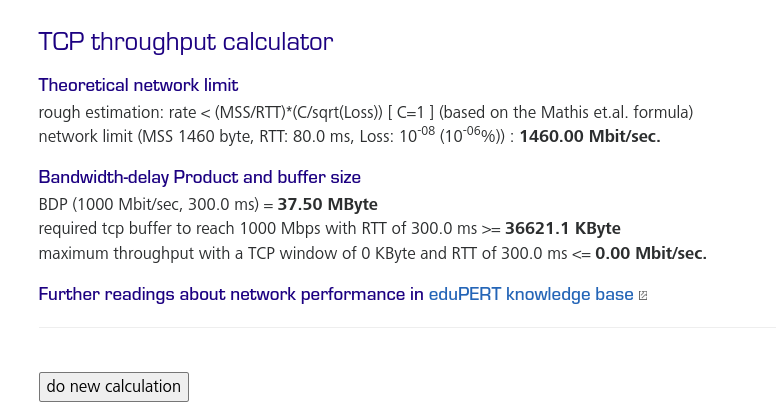
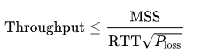

# Домашнее задание к занятию "3.7. Компьютерные сети, лекция 2"

1. На лекции мы обсудили, что манипулировать размером окна необходимо для эффективного наполнения приемного буфера участников TCP сессии (Flow Control). Подобная проблема в полной мере возникает в сетях с высоким RTT. Например, если вы захотите передать 500 Гб бэкап из региона Юга-Восточной Азии на Восточное побережье США. [Здесь](https://www.cloudping.co/grid) вы можете увидеть и 200 и 400 мс вполне реального RTT. Подсчитайте, какого размера нужно окно TCP чтобы наполнить 1 Гбит/с канал при 300 мс RTT (берем простую ситуацию без потери пакетов). Можно воспользоваться готовым [калькулятором](https://www.switch.ch/network/tools/tcp_throughput/). Ознакомиться с [формулами](https://en.wikipedia.org/wiki/TCP_tuning), по которым работает калькулятор можно, например, на Wiki.
   
   throughput=rwin/rtt;
   
   rwin=throughput*rtt=(0.3с * 1 Гбит/с)/8=37500000 байт = 36621,09 Кбайт

   

1. Во сколько раз упадет пропускная способность канала, если будет 1% потерь пакетов при передаче?
   
   Так как пропускная способность опеределяется формулой Mathis-a

   

   Где `P` - процент потерь. Теоретически 1% не влияет на пропускную способность.

1. Какая  максимальная реальная скорость передачи данных достижима при линке 100 Мбит/с? Вопрос про TCP payload, то есть цифры, которые вы реально увидите в операционной системе в тестах или в браузере при скачивании файлов. Повлияет ли размер фрейма на это?

   Стандарт Ethernet требует, чтобы между пакетами был 12-байтовый период «тишины», так и определяется окончание одного пакета и начало следующего. В конце каждого пакета также нужно передавать CRC-код (4 байта) для проверки целостности передачи, а в начале пакета — обязательную преамбулу из 8 байт. Есть и еще одно ограничение — минимальный размер пакета 60 байт

   Если учесть все ограничения, то пакеты должны быть минимум по 84 байта.

   100000000/(84*8)=148809 пакетов в секунду. Теоретический максимум на 2 уровне сети.

   Если мы используем не все 60 байт, достаточно 20 байт для IP-заголовка и 20 байт для TCP-заголовка, всего 40 байт.
   
   То есть эффективная скорость передачи пакетов составляет 148809 х 40 = 45,41 Мбит/с.

   Другими словами, даже если мы на 100% задействуем физический ресурс Ethernet, провайдер или программа замера трафика на 100 мегабитном канале покажет скорость передачи данных 5,68 Мбайт/с

   Чем больше фрейм, тем дольше длится передача.
   
   
1. Что на самом деле происходит, когда вы открываете сайт? :)
   На прошлой лекции был приведен сокращенный вариант ответа на этот вопрос. Теперь вы знаете намного больше, в частности про IP адресацию, DNS и т.д.
   Опишите максимально подробно насколько вы это можете сделать, что происходит, когда вы делаете запрос `curl -I http://netology.ru` с вашей рабочей станции. Предположим, что arp кеш очищен, в локальном DNS нет закешированных записей.
   
   Максимально подробно описано [тут](https://habr.com/ru/company/htmlacademy/blog/254825/).
   
   Честно говоря, лучше не раскрою тему. В данном случае нас интересуют пункты с 4 по 7 включительно.

1. Сколько и каких итеративных запросов будет сделано при резолве домена `www.google.co.uk`?

   Итеративный (он же прямой, он же нерекурсивный) запрос посылает доменное имя DNS серверу и просит вернуть либо IP адрес этого домена, либо имя DNS сервера, авторитативного для этого домена. При этом, сервер DNS не опрашивает другие серверы для получения ответа.

   * Первый запрос к локальному (любому другому) серверу, работающему в итеративном режиме.
   * Второй к корневым серверам.
   * Третий к серверам обслуживающим зону `uk`.
   * Четвертый к серверам обслуживающим зону `co.uk`.
   * Пятый  к серверам обслуживающим зону `google.co.uk`. От них должны получить адрес `www.google.co.uk`

1. Сколько доступно для назначения хостам адресов в подсети `/25`? А в подсети с маской `255.248.0.0`. Постарайтесь потренироваться в ручных вычислениях чтобы немного набить руку, не пользоваться калькулятором сразу.
   
   * 126 адресов.
 
     32-25=7 бит доступно хостам.

     2^7 =128 число адресов в сети

     128 -2(служебных)=126 адресов для хостов.

   * 524 286 адресов.
 
     255  = 8 бит;  248 = 5 бит
   
     8+5=13 бит занимает сеть
   
     32-13=19 бит доступно хостам
     
      219= 524 288 число адресов в сети
   
      524 288 -2=524 286 адресов для хостов

1. В какой подсети больше адресов, в `/23` или `/24`?
   
   В /24 меньше чем в /23.
   
   Чем большее количество бит принадлежит сети, тем меньше остается хостам.

   24>23 соответственно хостов в /24 меньше чем в /23.

   32-24=8; 32-23=9 	бит доступно хостам;
   
   2^8<2^9; 

   в /24 меньше чем в /23.

1. Получится ли разделить диапазон `10.0.0.0/8` на 128 подсетей по 131070 адресов в каждой? Какая маска будет у таких подсетей?

  - Да, можно. Считаем, что адресов выдаваемым хостам.
   
    32-8=24 бита доступно хостам.
   
    2^24=16 777 216 адресов в сети
   
    (131070+2(служебных))*128=16 777 216

  - Какая маска будет у таких подсетей?
     
    131070+2 = 131072 адреса в подсети

    131072=2^17; 17 бит доступно хостам

    32-17=15 бит доступно сети

    /15 или 255.254.0.0

 
 ---

## Как сдавать задания

Обязательными к выполнению являются задачи без указания звездочки. Их выполнение необходимо для получения зачета и диплома о профессиональной переподготовке.

Задачи со звездочкой (*) являются дополнительными задачами и/или задачами повышенной сложности. Они не являются обязательными к выполнению, но помогут вам глубже понять тему.

Домашнее задание выполните в файле readme.md в github репозитории. В личном кабинете отправьте на проверку ссылку на .md-файл в вашем репозитории.

Также вы можете выполнить задание в [Google Docs](https://docs.google.com/document/u/0/?tgif=d) и отправить в личном кабинете на проверку ссылку на ваш документ.
Название файла Google Docs должно содержать номер лекции и фамилию студента. Пример названия: "1.1. Введение в DevOps — Сусанна Алиева".

Если необходимо прикрепить дополнительные ссылки, просто добавьте их в свой Google Docs.

Перед тем как выслать ссылку, убедитесь, что ее содержимое не является приватным (открыто на комментирование всем, у кого есть ссылка), иначе преподаватель не сможет проверить работу. Чтобы это проверить, откройте ссылку в браузере в режиме инкогнито.

[Как предоставить доступ к файлам и папкам на Google Диске](https://support.google.com/docs/answer/2494822?hl=ru&co=GENIE.Platform%3DDesktop)

[Как запустить chrome в режиме инкогнито ](https://support.google.com/chrome/answer/95464?co=GENIE.Platform%3DDesktop&hl=ru)

[Как запустить  Safari в режиме инкогнито ](https://support.apple.com/ru-ru/guide/safari/ibrw1069/mac)

Любые вопросы по решению задач задавайте в чате Slack.

---
