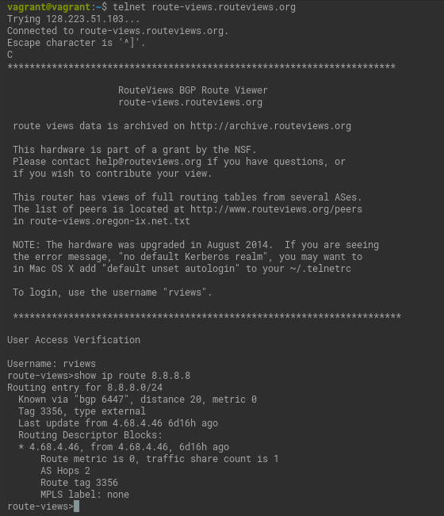
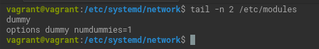
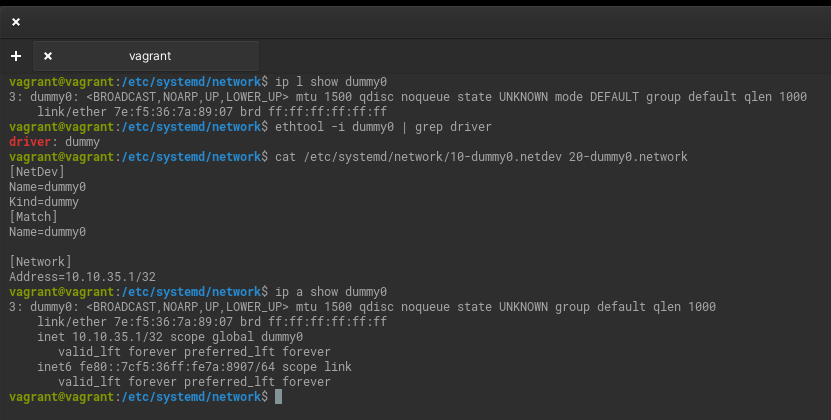
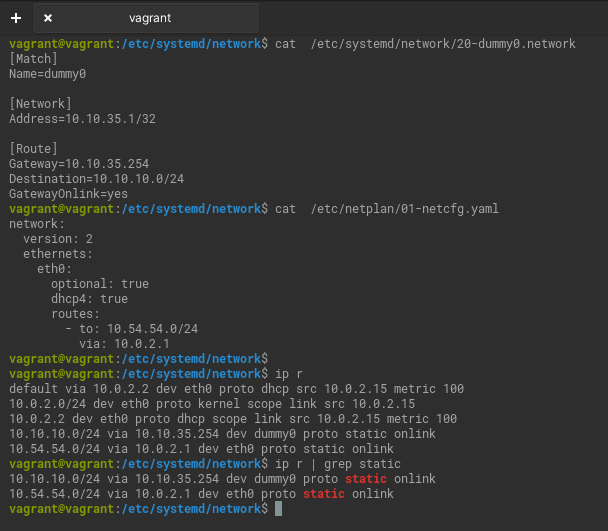
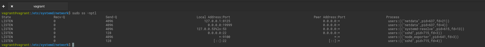
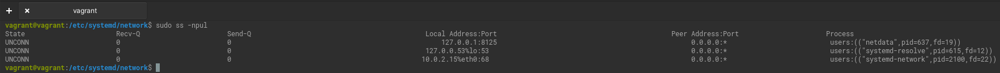
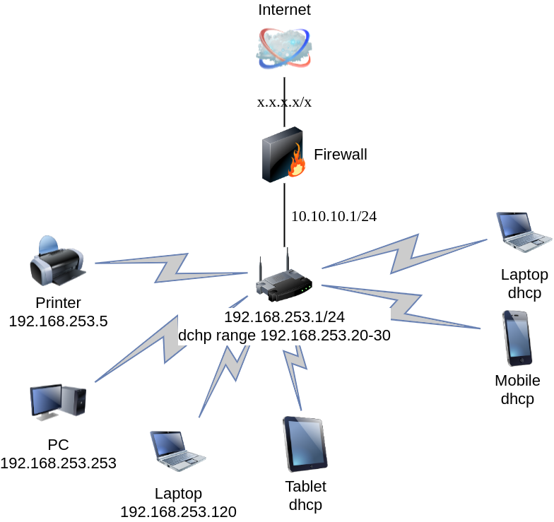
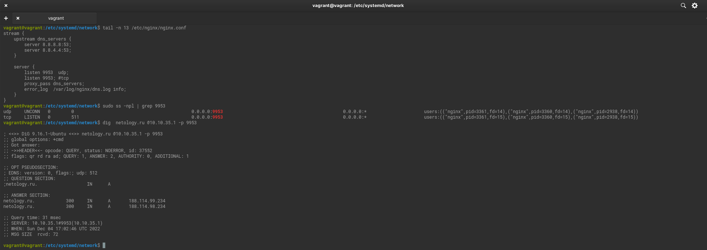

# Домашнее задание к занятию "3.8. Компьютерные сети, лекция 3"

### Цель задания

В результате выполнения этого задания вы:

1. На практике познакомитесь с маршрутизацией в сетях, что позволит понять устройство больших корпоративных сетей и интернета.
2. Проверите TCP/UDP соединения на хосте (это обычный этап отладки сетевых проблем).
3. Построите сетевую диаграмму.

### Чеклист готовности к домашнему заданию

1. Убедитесь, что у вас установлен `telnet`.
2. Воспользуйтесь пакетным менеджером apt для установки.


### Инструкция к заданию

1. Создайте .md-файл для ответов на задания в своём репозитории, после выполнения прикрепите ссылку на него в личном кабинете.
2. Любые вопросы по выполнению заданий спрашивайте в чате учебной группы и/или в разделе “Вопросы по заданию” в личном кабинете.


### Инструменты/ дополнительные материалы, которые пригодятся для выполнения задания

1. [Зачем нужны dummy интерфейсы](https://tldp.org/LDP/nag/node72.html)

------

## Задание

1. Подключитесь к публичному маршрутизатору в интернет. Найдите маршрут к вашему публичному IP
   ```
   telnet route-views.routeviews.org
   Username: rviews
   show ip route x.x.x.x/32
   show bgp x.x.x.x/32
   ```

   
```commandline
  route-views>show bgp 8.8.8.8
BGP routing table entry for 8.8.8.0/24, version 2583334729
Paths: (21 available, best #8, table default)
  Not advertised to any peer
  Refresh Epoch 1
  3333 15169
    193.0.0.56 from 193.0.0.56 (193.0.0.56)
      Origin IGP, localpref 100, valid, external
      path 7FE102704308 RPKI State valid
      rx pathid: 0, tx pathid: 0
  Refresh Epoch 1
  3267 15169
    194.85.40.15 from 194.85.40.15 (185.141.126.1)
      Origin IGP, metric 0, localpref 100, valid, external
      path 7FE0CB801238 RPKI State valid
      rx pathid: 0, tx pathid: 0
  Refresh Epoch 1
  7018 15169
    12.0.1.63 from 12.0.1.63 (12.0.1.63)
      Origin IGP, localpref 100, valid, external
      Community: 7018:2500 7018:37232
      path 7FE122FBE3A8 RPKI State valid
      rx pathid: 0, tx pathid: 0
  Refresh Epoch 1
  701 15169
    137.39.3.55 from 137.39.3.55 (137.39.3.55)
      Origin IGP, localpref 100, valid, external
      path 7FE1585B9E90 RPKI State valid
      rx pathid: 0, tx pathid: 0
  Refresh Epoch 1
  8283 15169
    94.142.247.3 from 94.142.247.3 (94.142.247.3)
      Origin IGP, metric 0, localpref 100, valid, external
      Community: 8283:1 8283:101 8283:102
      unknown transitive attribute: flag 0xE0 type 0x20 length 0x30
        value 0000 205B 0000 0000 0000 0001 0000 205B
              0000 0005 0000 0001 0000 205B 0000 0005
              0000 0002 0000 205B 0000 0008 0000 001A
              
      path 7FE18ABEF3E8 RPKI State valid
      rx pathid: 0, tx pathid: 0
  Refresh Epoch 1
  57866 15169
    37.139.139.17 from 37.139.139.17 (37.139.139.17)
      Origin IGP, metric 0, localpref 100, valid, external
      Community: 57866:200 65102:56393 65103:1 65104:31
      unknown transitive attribute: flag 0xE0 type 0x20 length 0x30
        value 0000 E20A 0000 0065 0000 00C8 0000 E20A
              0000 0066 0000 DC49 0000 E20A 0000 0067
              0000 0001 0000 E20A 0000 0068 0000 001F
              
      path 7FE0111C2988 RPKI State valid
      rx pathid: 0, tx pathid: 0
  Refresh Epoch 1
  20912 15169
    212.66.96.126 from 212.66.96.126 (212.66.96.126)
      Origin IGP, localpref 100, valid, external
      Community: 20912:65016
      path 7FE089E4A558 RPKI State valid
      rx pathid: 0, tx pathid: 0
  Refresh Epoch 1
  3356 15169
    4.68.4.46 from 4.68.4.46 (4.69.184.201)
      Origin IGP, metric 0, localpref 100, valid, external, best
      Community: 3356:3 3356:86 3356:576 3356:666 3356:901 3356:2012
      path 7FE0F8D1B150 RPKI State valid
      rx pathid: 0, tx pathid: 0x0
  Refresh Epoch 1
  3549 3356 15169
    208.51.134.254 from 208.51.134.254 (67.16.168.191)
      Origin IGP, metric 0, localpref 100, valid, external
      Community: 3356:3 3356:22 3356:86 3356:575 3356:666 3356:901 3356:2011 3549:2581 3549:30840
      path 7FE0CD39BC88 RPKI State valid
      rx pathid: 0, tx pathid: 0
  Refresh Epoch 2
  2497 15169
    202.232.0.2 from 202.232.0.2 (58.138.96.254)
      Origin IGP, localpref 100, valid, external
      path 7FE0E1543D18 RPKI State valid
      rx pathid: 0, tx pathid: 0
  Refresh Epoch 1
  3561 209 3356 15169
    206.24.210.80 from 206.24.210.80 (206.24.210.80)
      Origin IGP, localpref 100, valid, external
      path 7FE0E7997038 RPKI State valid
      rx pathid: 0, tx pathid: 0
  Refresh Epoch 1
  101 15169
    209.124.176.223 from 209.124.176.223 (209.124.176.223)
      Origin IGP, localpref 100, valid, external
      Community: 101:20400 101:22200
      path 7FE0FD642530 RPKI State valid
      rx pathid: 0, tx pathid: 0
  Refresh Epoch 1
  4901 6079 15169
    162.250.137.254 from 162.250.137.254 (162.250.137.254)
      Origin IGP, localpref 100, valid, external
      Community: 65000:10100 65000:10300 65000:10400
      path 7FE0160C75B0 RPKI State valid
      rx pathid: 0, tx pathid: 0
  Refresh Epoch 1
  20130 6939 15169
    140.192.8.16 from 140.192.8.16 (140.192.8.16)
      Origin IGP, localpref 100, valid, external
      path 7FE11D2488C8 RPKI State valid
      rx pathid: 0, tx pathid: 0
  Refresh Epoch 1
  53767 174 174 6453 15169
    162.251.163.2 from 162.251.163.2 (162.251.162.3)
      Origin IGP, localpref 100, valid, external
      Community: 174:21000 174:22013 53767:5000
      path 7FE1423CD650 RPKI State valid
      rx pathid: 0, tx pathid: 0
  Refresh Epoch 1
  852 15169
    154.11.12.212 from 154.11.12.212 (96.1.209.43)
      Origin IGP, metric 0, localpref 100, valid, external
      path 7FE0F82F7008 RPKI State valid
      rx pathid: 0, tx pathid: 0
  Refresh Epoch 1
  49788 12552 15169
    91.218.184.60 from 91.218.184.60 (91.218.184.60)
      Origin IGP, localpref 100, valid, external
      Community: 12552:10000 12552:14000 12552:14100 12552:14101 12552:24000
      Extended Community: 0x43:100:0
      path 7FE0A8ECCD98 RPKI State valid
      rx pathid: 0, tx pathid: 0
  Refresh Epoch 1
  1351 15169
    132.198.255.253 from 132.198.255.253 (132.198.255.253)
      Origin IGP, localpref 100, valid, external
      path 7FE0400188F0 RPKI State valid
      rx pathid: 0, tx pathid: 0
  Refresh Epoch 1
  6939 15169
    64.71.137.241 from 64.71.137.241 (216.218.252.164)
      Origin IGP, localpref 100, valid, external
      path 7FE14CD8CDC8 RPKI State valid
      rx pathid: 0, tx pathid: 0
  Refresh Epoch 1
  3303 15169
    217.192.89.50 from 217.192.89.50 (138.187.128.158)
      Origin IGP, localpref 100, valid, external
      Community: 3303:1004 3303:1007 3303:3067
      path 7FE11D5AF288 RPKI State valid
      rx pathid: 0, tx pathid: 0
  Refresh Epoch 1
  3257 15169
    89.149.178.10 from 89.149.178.10 (213.200.83.26)
      Origin IGP, metric 10, localpref 100, valid, external
      Community: 3257:8052 3257:30306 3257:50001 3257:54900 3257:54901
      path 7FE153293388 RPKI State valid
      rx pathid: 0, tx pathid: 0

```

2. Создайте dummy0 интерфейс в Ubuntu. Добавьте несколько статических маршрутов. Проверьте таблицу маршрутизации.
   
   
   
   netplan не поддерживает dummy. [Подробности тут](https://bugs.launchpad.net/netplan/+bug/1774203)
   
   
   
   

3. Проверьте открытые TCP порты в Ubuntu, какие протоколы и приложения используют эти порты? Приведите несколько примеров.
   
   

   sshd - 22, netdata - 19999 и 8125, systemd-resolve - 53, node_exporter - 9100.

4. Проверьте используемые UDP сокеты в Ubuntu, какие протоколы и приложения используют эти порты?

   

   netdata - 8125,systemd-resolve - 53, systemd-network -68

5. Используя diagrams.net, создайте L3 диаграмму вашей домашней сети или любой другой сети, с которой вы работали.
   
   

*В качестве решения ответьте на вопросы, опишите, каким образом эти ответы были получены и приложите по неоходимости скриншоты*

 ---
 
## Задание для самостоятельной отработки* (необязательно к выполнению)

6. Установите Nginx, настройте в режиме балансировщика TCP или UDP.

   

7. Установите bird2, настройте динамический протокол маршрутизации RIP.

8. Установите Netbox, создайте несколько IP префиксов, используя curl проверьте работу API.

----

### Правила приема домашнего задания

В личном кабинете отправлена ссылка на .md файл в вашем репозитории.

-----

### Критерии оценки

Зачет - выполнены все задания, ответы даны в развернутой форме, приложены соответствующие скриншоты и файлы проекта, в выполненных заданиях нет противоречий и нарушения логики.

На доработку - задание выполнено частично или не выполнено, в логике выполнения заданий есть противоречия, существенные недостатки. 
 
Обязательными к выполнению являются задачи без указания звездочки. Их выполнение необходимо для получения зачета и диплома о профессиональной переподготовке.
Задачи со звездочкой (*) являются дополнительными задачами и/или задачами повышенной сложности. Они не являются обязательными к выполнению, но помогут вам глубже понять тему.
