# Домашнее задание к занятию "3.9. Элементы безопасности информационных систем"


### Цель задания

В результате выполнения этого задания вы: 

1. Настроите парольный менеджер, что позволит не использовать один и тот же пароль на все ресурсы и удобно работать с множеством паролей.
2. Настроите веб-сервер на работу с https. Сегодня https является стандартом в интернете. Понимание сути работы центра сертификации, цепочки сертификатов позволит понять, на чем основывается https протокол.
3. Сконфигурируете ssh клиент на работу с разными серверами по-разному, что дает большую гибкость ssh соединений. Например, к некоторым серверам мы можем обращаться по ssh через приложения, где недоступен ввод пароля.
4. Поработаете со сбором и анализом трафика, которые необходимы для отладки сетевых проблем


### Инструкция к заданию

1. Создайте .md-файл для ответов на задания в своём репозитории, после выполнения прикрепите ссылку на него в личном кабинете.
2. Любые вопросы по выполнению заданий спрашивайте в чате учебной группы и/или в разделе “Вопросы по заданию” в личном кабинете.


### Инструменты/ дополнительные материалы, которые пригодятся для выполнения задания

1. [SSL + Apache2](https://digitalocean.com/community/tutorials/how-to-create-a-self-signed-ssl-certificate-for-apache-in-ubuntu-20-04)
2. [Руководство по подготовке к экзамену CISSP](https://dorlov.blogspot.com/2011/05/issp-cissp-all-in-one-exam-guide.html)
3. [Awesome SSH проекты](https://project-awesome.org/moul/awesome-ssh)
4. [Teleport - альтернатива SSH](https://goteleport.com/docs/getting-started/linux-server/)
5. [ngrok - NAT traversal](https://github.com/inconshreveable/ngrok)
6. [ssh-audit](https://github.com/arthepsy/ssh-audit)
7. [Mozilla SSL Configuration Generator](https://ssl-config.mozilla.org/)
8. [Kali Linux](https://tools.kali.org/tools-listing)
9. [Testing TLS/SSL encryption anywhere on any port](https://github.com/drwetter/testssl.sh)
10. [Bitwarden](https://github.com/bitwarden/server)

------

## Задание

1. Установите Bitwarden плагин для браузера. Зарегестрируйтесь и сохраните несколько паролей.

   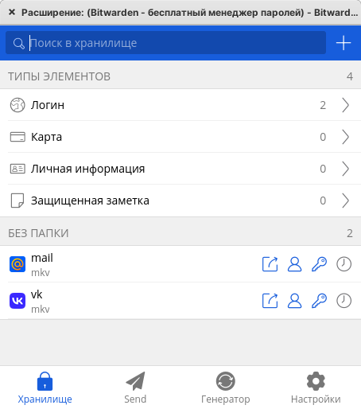

2. Установите Google authenticator на мобильный телефон. Настройте вход в Bitwarden акаунт через Google authenticator OTP.

   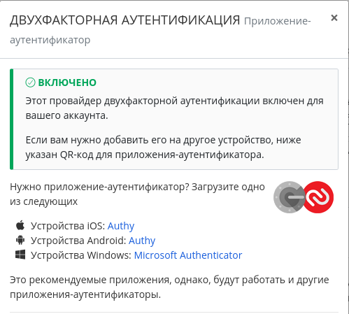

3. Установите apache2, сгенерируйте самоподписанный сертификат, настройте тестовый сайт для работы по HTTPS.

   ``` bash
   sudo apt install apache2
   sudo a2enmod ssl
   sudo systemctl restart apache2
   sudo openssl req -x509 -nodes -days 365 -newkey rsa:2048 -keyout /etc/apache2/ssl/ssl.key -out /etc/apache2/ssl/ssl.crt
   ```
   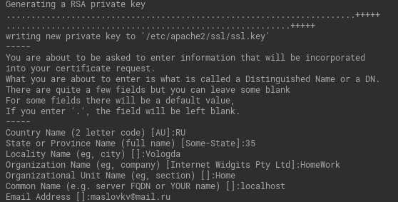

   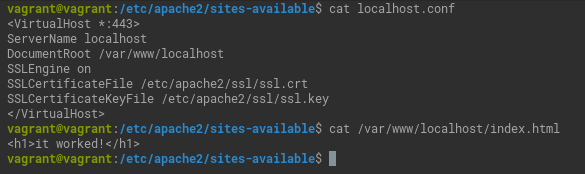
   
   ```bash
   sudo a2ensite localhost.conf
   
   Enabling site localhost.
   To activate the new configuration, you need to run:
     systemctl reload apache2
   
   sudo systemctl reload apache2
   ```
   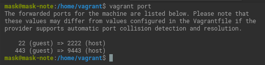
   
   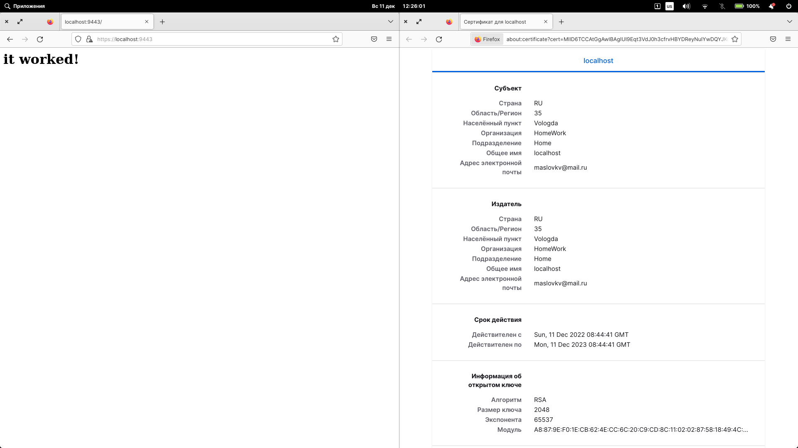
4. Проверьте на TLS уязвимости произвольный сайт в интернете (кроме сайтов МВД, ФСБ, МинОбр, НацБанк, РосКосмос, РосАтом, РосНАНО и любых госкомпаний, объектов КИИ, ВПК ... и тому подобное).
   
   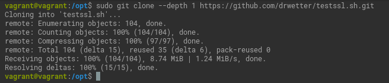
  
   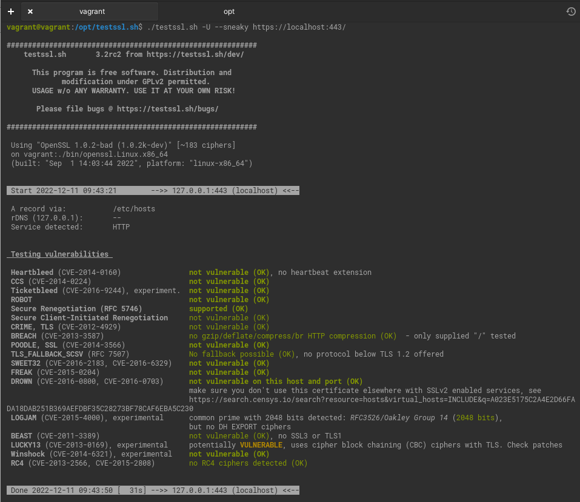

   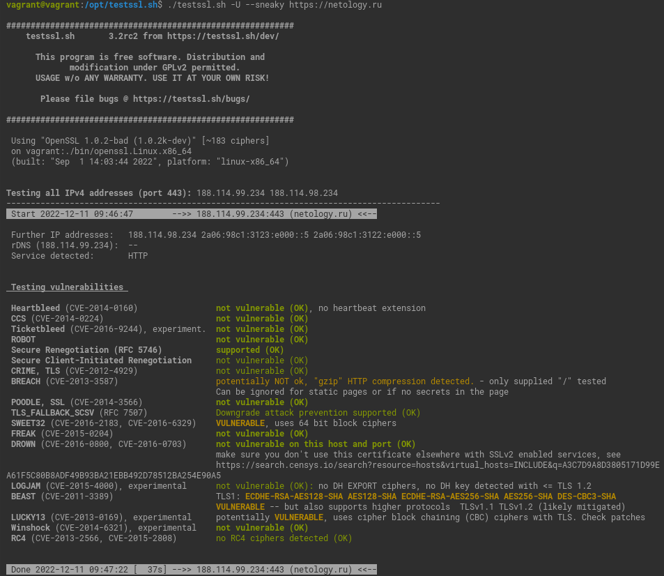

   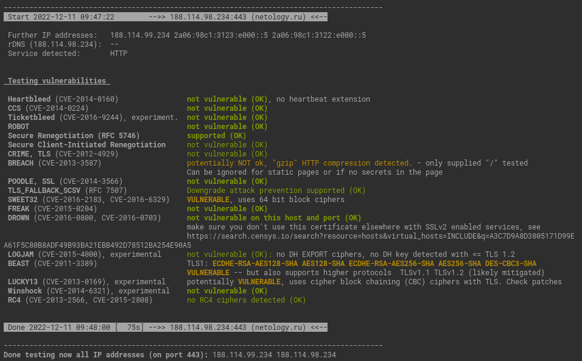

5. Установите на Ubuntu ssh сервер, сгенерируйте новый приватный ключ. Скопируйте свой публичный ключ на другой сервер. Подключитесь к серверу по SSH-ключу.
   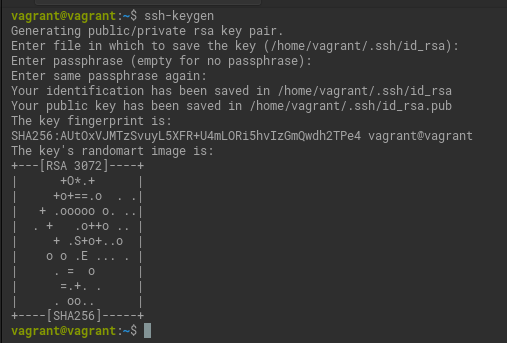

   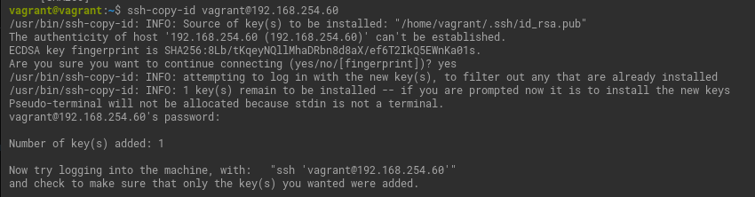

   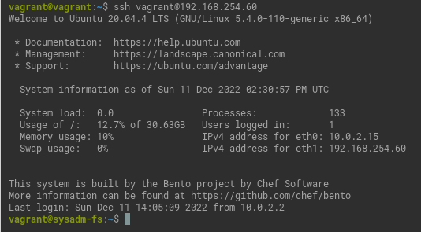
6. Переименуйте файлы ключей из задания 5. Настройте файл конфигурации SSH клиента, так чтобы вход на удаленный сервер осуществлялся по имени сервера.

   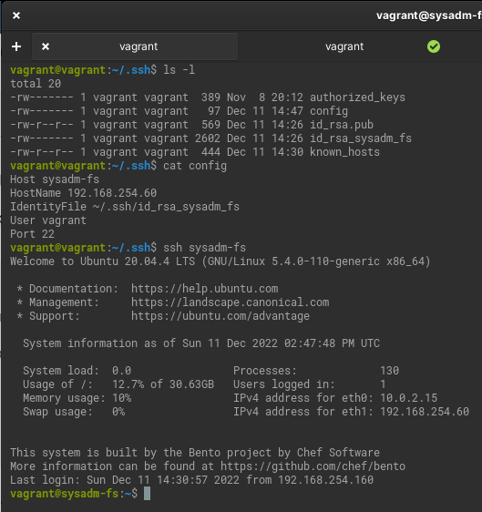

7. Соберите дамп трафика утилитой tcpdump в формате pcap, 100 пакетов. Откройте файл pcap в Wireshark.

   `sudo tcpdump -v -c 100 -i eth0 -w test.pcap`

   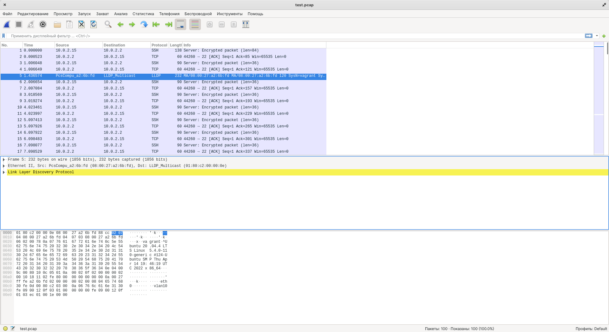

*В качестве решения приложите: скриншоты, выполняемые команды, комментарии (по необходимости).*

 ---
 
## Задание для самостоятельной отработки* (необязательно к выполнению)

8. Просканируйте хост scanme.nmap.org. Какие сервисы запущены?

   `sudo apt install -y nmap `
   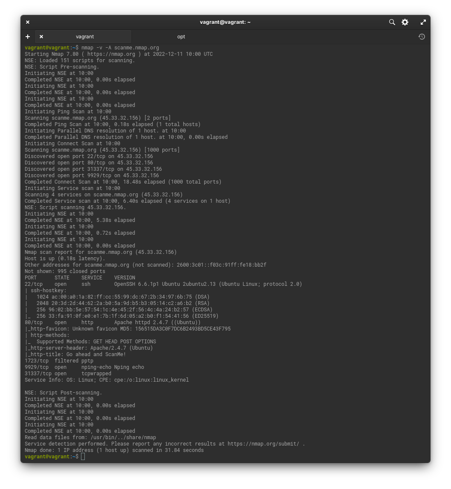

   ```bash
   PORT      STATE    SERVICE    VERSION
   22/tcp    open     ssh        OpenSSH 6.6.1p1 Ubuntu 2ubuntu2.13 (Ubuntu Linux; protocol 2.0)
   80/tcp    open     http       Apache httpd 2.4.7 ((Ubuntu))
   1723/tcp  filtered pptp
   9929/tcp  open     nping-echo Nping echo
   31337/tcp open     tcpwrapped
   ```
9. Установите и настройте фаервол ufw на web-сервер из задания 3. Откройте доступ снаружи только к портам 22,80,443

   `sudo apt install -y ufw`
    
   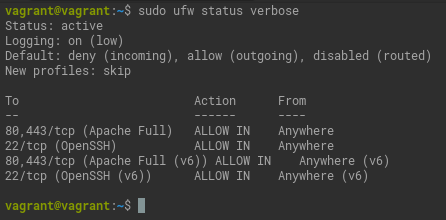

----

### Правила приема домашнего задания

В личном кабинете отправлена ссылка на .md файл в вашем репозитории.

-----

### Критерии оценки

Зачет - выполнены все задания, ответы даны в развернутой форме, приложены соответствующие скриншоты и файлы проекта, в выполненных заданиях нет противоречий и нарушения логики.

На доработку - задание выполнено частично или не выполнено, в логике выполнения заданий есть противоречия, существенные недостатки. 
 
Обязательными к выполнению являются задачи без указания звездочки. Их выполнение необходимо для получения зачета и диплома о профессиональной переподготовке.
Задачи со звездочкой (*) являются дополнительными задачами и/или задачами повышенной сложности. Они не являются обязательными к выполнению, но помогут вам глубже понять тему.