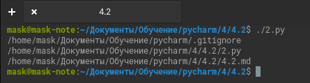
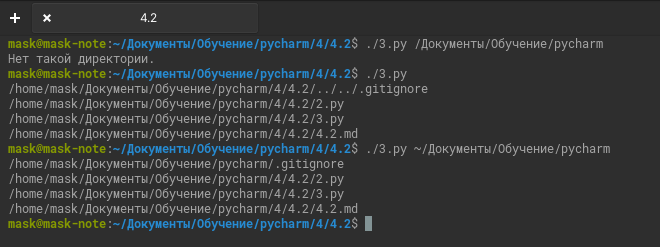
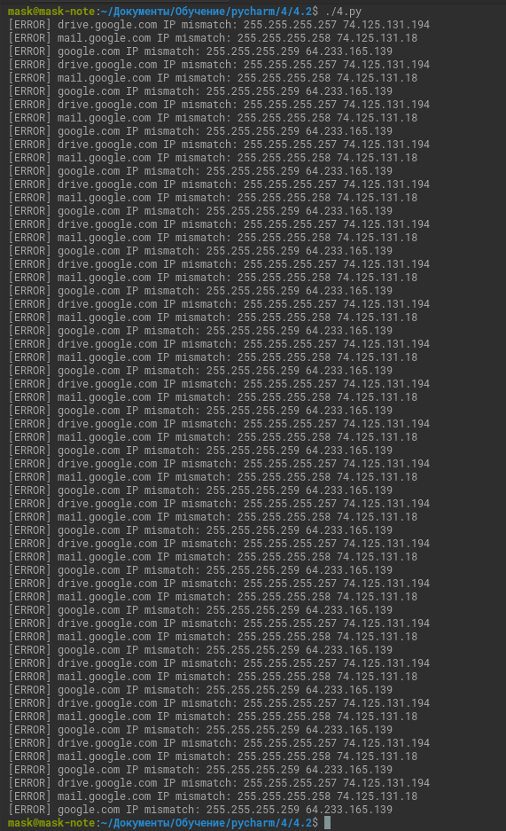

# Домашнее задание к занятию "4.2. Использование Python для решения типовых DevOps задач"

### Цель задания

В результате выполнения этого задания вы:

1. Познакомитесь с синтаксисом Python.
2. Узнаете, для каких типов задач его можно использовать.
3. Воспользуетесь несколькими модулями для работы с ОС.


### Инструкция к заданию

1. Установите Python 3 любой версии.
2. Скопируйте в свой .md-файл содержимое этого файла; исходники можно посмотреть [здесь](https://raw.githubusercontent.com/netology-code/sysadm-homeworks/devsys10/04-script-01-bash/README.md).
3. Заполните недостающие части документа решением задач (заменяйте `???`, остальное в шаблоне не меняйте, чтобы не сломать форматирование текста, подсветку синтаксиса). Вместо логов можно вставить скриншоты по желанию.
4. Для проверки домашнего задания преподавателем в личном кабинете прикрепите и отправьте ссылку на решение в виде md-файла в вашем Github.
5. Любые вопросы по выполнению заданий спрашивайте в чате учебной группы и/или в разделе “Вопросы по заданию” в личном кабинете.

------

## Задание 1

Есть скрипт:
```python
#!/usr/bin/env python3
a = 1
b = '2'
c = a + b
```

### Вопросы:

| Вопрос  | Ответ     |
| ------------- |-----------|
| Какое значение будет присвоено переменной `c`?  | Получим ошибку `TypeError: unsupported operand type(s) for +: 'int' and 'str'` |
| Как получить для переменной `c` значение 12?  | `c = str(a) + b`          |
| Как получить для переменной `c` значение 3?  | c = a + int(b)          |

------

## Задание 2

Мы устроились на работу в компанию, где раньше уже был DevOps Engineer. Он написал скрипт, позволяющий узнать, какие файлы модифицированы в репозитории, относительно локальных изменений. Этим скриптом недовольно начальство, потому что в его выводе есть не все изменённые файлы, а также непонятен полный путь к директории, где они находятся. 

Как можно доработать скрипт ниже, чтобы он исполнял требования вашего руководителя?

```python
#!/usr/bin/env python3

import os

bash_command = ["cd ~/netology/sysadm-homeworks", "git status"]
result_os = os.popen(' && '.join(bash_command)).read()
is_change = False
for result in result_os.split('\n'):
    if result.find('modified') != -1:
        prepare_result = result.replace('\tmodified:   ', '')
        print(prepare_result)
        break
```

### Ваш скрипт:
```python
#!/usr/bin/env python3

import os

bash_command = ["cd ~/Документы/Обучение/pycharm", "git status"]
result_os = os.popen(' && '.join(bash_command)).read()
pathtodir = os.popen(' && '.join([bash_command[0], "pwd"])).read()

#is_change = False #Не используется.
for result in result_os.split('\n'):
    if result.find('изменено') != -1:
        prepare_result = result.replace('\tизменено:      ', '')
        #Добавлен полный путь каталога
        print(str(pathtodir).rstrip('\r\n') + "/" + prepare_result)
        #break #Исправлена ошибка вывода всех файлов.
```

### Вывод скрипта при запуске при тестировании:




------

## Задание 3

Доработать скрипт выше так, чтобы он не только мог проверять локальный репозиторий в текущей директории, но и умел воспринимать путь к репозиторию, который мы передаём как входной параметр. Мы точно знаем, что начальство коварное и будет проверять работу этого скрипта в директориях, которые не являются локальными репозиториями.

### Ваш скрипт:
```python
#!/usr/bin/env python3

import os
import sys

if len(sys.argv) > 1:
    pathtodir = sys.argv[1]
else:
    pathtodir = os.getcwd()

if os.path.isdir(pathtodir):
    bash_command = ["cd " + pathtodir, "git status 2>&1"]
    result_os = os.popen(' && '.join(bash_command)).read()

    for result in result_os.split('\n'):
        if result.find('fatal') != -1:
            print(pathtodir + "- не являтся git-репозиторием")
            break
        if result.find('изменено') != -1:
            prepare_result = result.replace('\tизменено:      ', '')
            print(str(pathtodir).rstrip('\r\n') + "/" + prepare_result)
else:
    print("Нет такой директории.")
```

### Вывод скрипта при запуске при тестировании:



------

## Задание 4

Наша команда разрабатывает несколько веб-сервисов, доступных по http. Мы точно знаем, что на их стенде нет никакой балансировки, кластеризации, за DNS прячется конкретный IP сервера, где установлен сервис. 

Проблема в том, что отдел, занимающийся нашей инфраструктурой очень часто меняет нам сервера, поэтому IP меняются примерно раз в неделю, при этом сервисы сохраняют за собой DNS имена. Это бы совсем никого не беспокоило, если бы несколько раз сервера не уезжали в такой сегмент сети нашей компании, который недоступен для разработчиков. 

Мы хотим написать скрипт, который: 
- опрашивает веб-сервисы, 
- получает их IP, 
- выводит информацию в стандартный вывод в виде: <URL сервиса> - <его IP>. 

Также, должна быть реализована возможность проверки текущего IP сервиса c его IP из предыдущей проверки. Если проверка будет провалена - оповестить об этом в стандартный вывод сообщением: [ERROR] <URL сервиса> IP mismatch: <старый IP> <Новый IP>. Будем считать, что наша разработка реализовала сервисы: `drive.google.com`, `mail.google.com`, `google.com`.

### Ваш скрипт:
```python
#!/usr/bin/env python3

from socket import gethostbyname as sgethostbyname
from time import sleep as sleep

dns_ip = {'drive.google.com':'255.255.255.257',
          'mail.google.com':'255.255.255.258',
          'google.com':'255.255.255.259'
          }
i = 0   # Счетчик
while True:
    for svc in dns_ip.keys():
        old_ip = dns_ip.get(svc)
        ip = sgethostbyname(svc)
        if ip == old_ip:
            print(svc + ' ' + ip + ' ip адрес не изменился.')
        else:
            print('[ERROR] ' + svc + ' IP mismatch: ' + old_ip + ' ' + ip)
    i += 1
    if i == 20:
        break
    sleep(60)
```
### Вывод скрипта при запуске при тестировании:



------

## Дополнительное задание (со звездочкой*) - необязательно к выполнению

Так получилось, что мы очень часто вносим правки в конфигурацию своей системы прямо на сервере. Но так как вся наша команда разработки держит файлы конфигурации в github и пользуется gitflow, то нам приходится каждый раз: 
* переносить архив с нашими изменениями с сервера на наш локальный компьютер, 
* формировать новую ветку, 
* коммитить в неё изменения, 
* создавать pull request (PR) 
* и только после выполнения Merge мы наконец можем официально подтвердить, что новая конфигурация применена. 

Мы хотим максимально автоматизировать всю цепочку действий. 
* Для этого нам нужно написать скрипт, который будет в директории с локальным репозиторием обращаться по API к github, создавать PR для вливания текущей выбранной ветки в master с сообщением, которое мы вписываем в первый параметр при обращении к py-файлу (сообщение не может быть пустым).
* При желании, можно добавить к указанному функционалу создание новой ветки, commit и push в неё изменений конфигурации. 
* С директорией локального репозитория можно делать всё, что угодно. 
* Также, принимаем во внимание, что Merge Conflict у нас отсутствуют и их точно не будет при push, как в свою ветку, так и при слиянии в master. 

Важно получить конечный результат с созданным PR, в котором применяются наши изменения. 

### Ваш скрипт:
```python
???
```

### Вывод скрипта при запуске при тестировании:
```
???
```

----

### Правила приема домашнего задания

В личном кабинете отправлена ссылка на .md файл в вашем репозитории.

-----

### Критерии оценки

Зачет - выполнены все задания, ответы даны в развернутой форме, приложены соответствующие скриншоты и файлы проекта, в выполненных заданиях нет противоречий и нарушения логики.

На доработку - задание выполнено частично или не выполнено, в логике выполнения заданий есть противоречия, существенные недостатки. 
 
Обязательными к выполнению являются задачи без указания звездочки. Их выполнение необходимо для получения зачета и диплома о профессиональной переподготовке.
Задачи со звездочкой (*) являются дополнительными задачами и/или задачами повышенной сложности. Они не являются обязательными к выполнению, но помогут вам глубже понять тему.
