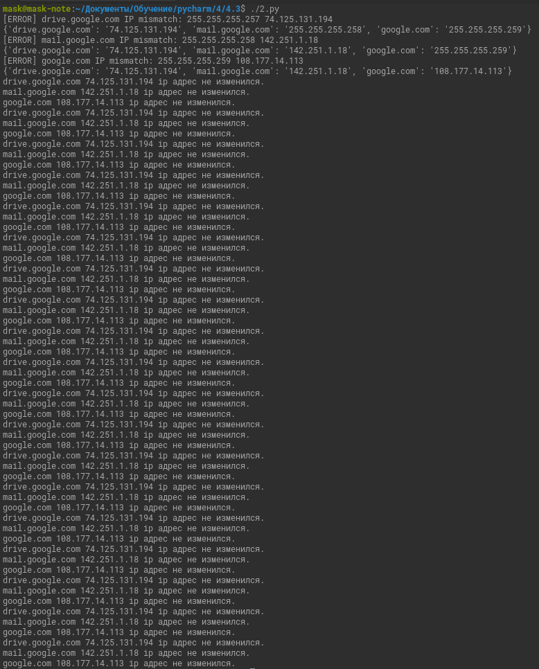

# Домашнее задание к занятию "4.3. Языки разметки JSON и YAML"

### Цель задания

В результате выполнения этого задания вы:

1. Познакомитесь с синтаксисами JSON и YAML.
2. Узнаете как преобразовать один формат в другой при помощи пары строк.

### Чеклист готовности к домашнему заданию

Установлена библиотека pyyaml для Python 3.

### Инструкция к заданию 

1. Скопируйте в свой .md-файл содержимое этого файла; исходники можно посмотреть [здесь](https://raw.githubusercontent.com/netology-code/sysadm-homeworks/devsys-24/04-script-03-yaml/README.md).
2. Заполните недостающие части документа решением задач (заменяйте `???`, остальное в шаблоне не меняйте, чтобы не сломать форматирование текста, подсветку синтаксиса и прочее) и отправляйте на проверку. Вместо логов можно вставить скриншоты по желанию.
3. Любые вопросы по выполнению заданий спрашивайте в чате учебной группы и/или в разделе “Вопросы по заданию” в личном кабинете.


------

## Задание 1

## Обязательная задача 1
Мы выгрузили JSON, который получили через API запрос к нашему сервису:

```
    { "info" : "Sample JSON output from our service\t",
        "elements" :[
            { "name" : "first",
            "type" : "server",
            "ip" : 7175 
            }
            { "name" : "second",
            "type" : "proxy",
            "ip : 71.78.22.43
            }
        ]
    }
```
  Нужно найти и исправить все ошибки, которые допускает наш сервис

### Ваш файл:
1. `\t` - горизонтальный таб, находящийся в строке, нужно дополнительно экранировать.
2. Удалил или добавил пробелы и перенос строки для единообразия и читаемости.
3. Упущена запятая между элементами массива
4. В первой коллекции исправлено значение ip.
5. Во второй ключ и значение ip.
```
{ 
  "info" : "Sample JSON output from our service\\t",
  "elements" : [
    {
      "name" : "first",
      "type" : "server",
      "ip" : "71.75.22.43" 
    },
    {
      "name" : "second",
      "type" : "proxy",
      "ip" : "71.78.22.43"
    }
  ]
}
```

---

## Задание 2

В прошлый рабочий день мы создавали скрипт, позволяющий опрашивать веб-сервисы и получать их IP. К уже реализованному функционалу нам нужно добавить возможность записи JSON и YAML файлов, описывающих наши сервисы. Формат записи JSON по одному сервису: `{ "имя сервиса" : "его IP"}`. Формат записи YAML по одному сервису: `- имя сервиса: его IP`. Если в момент исполнения скрипта меняется IP у сервиса - он должен так же поменяться в yml и json файле.

### Ваш скрипт:
```python
#!/usr/bin/env python3

from socket import gethostbyname as sghbn
from time import sleep as sleep
import json
import yaml


dns_ip = {'drive.google.com': '255.255.255.257',
          'mail.google.com': '255.255.255.258',
          'google.com': '255.255.255.259'
          }
i = 0   # Счетчик
while True:
    for svc in dns_ip.keys():
        old_ip = dns_ip.get(svc)
        ip = sghbn(svc)
        if ip == old_ip:
            print(svc + ' ' + ip + ' ip адрес не изменился.')
        else:
            print('[ERROR] ' + svc + ' IP mismatch: ' + old_ip + ' ' + ip)
            dns_ip.update({svc : ip})
            print(dns_ip)
            with open("dns_ip.json", "w") as fp_json:
                json.dump(dns_ip, fp_json, indent=4)
            with open("dns_ip.yaml", "w") as fp_yaml:
                yaml.dump(dns_ip, fp_yaml, explicit_start=True, explicit_end=True)
    i += 1
    if i == 20:
        break
    sleep(60)

```

### Вывод скрипта при запуске при тестировании:


### json-файл(ы), который(е) записал ваш скрипт:
```json
{
    "drive.google.com": "74.125.131.194",
    "mail.google.com": "142.251.1.18",
    "google.com": "108.177.14.113"
}
```

### yml-файл(ы), который(е) записал ваш скрипт:
```yaml
---
drive.google.com: 74.125.131.194
google.com: 108.177.14.113
mail.google.com: 142.251.1.18
...

```

---

## Дополнительное задание (со звездочкой*) - необязательно к выполнению

Так как команды в нашей компании никак не могут прийти к единому мнению о том, какой формат разметки данных использовать: JSON или YAML, нам нужно реализовать парсер из одного формата в другой. Он должен уметь:
   * Принимать на вход имя файла
   * Проверять формат исходного файла. Если файл не json или yml - скрипт должен остановить свою работу
   * Распознавать какой формат данных в файле. Считается, что файлы *.json и *.yml могут быть перепутаны
   * Перекодировать данные из исходного формата во второй доступный (из JSON в YAML, из YAML в JSON)
   * При обнаружении ошибки в исходном файле - указать в стандартном выводе строку с ошибкой синтаксиса и её номер
   * Полученный файл должен иметь имя исходного файла, разница в наименовании обеспечивается разницей расширения файлов

### Ваш скрипт:
```python
???
```

### Пример работы скрипта:
???

----

### Правила приема домашнего задания

В личном кабинете отправлена ссылка на .md файл в вашем репозитории.

-----

### Критерии оценки

Зачет - выполнены все задания, ответы даны в развернутой форме, приложены соответствующие скриншоты и файлы проекта, в выполненных заданиях нет противоречий и нарушения логики.

На доработку - задание выполнено частично или не выполнено, в логике выполнения заданий есть противоречия, существенные недостатки. 
 
Обязательными к выполнению являются задачи без указания звездочки. Их выполнение необходимо для получения зачета и диплома о профессиональной переподготовке.
Задачи со звездочкой (*) являются дополнительными задачами и/или задачами повышенной сложности. Они не являются обязательными к выполнению, но помогут вам глубже понять тему.
