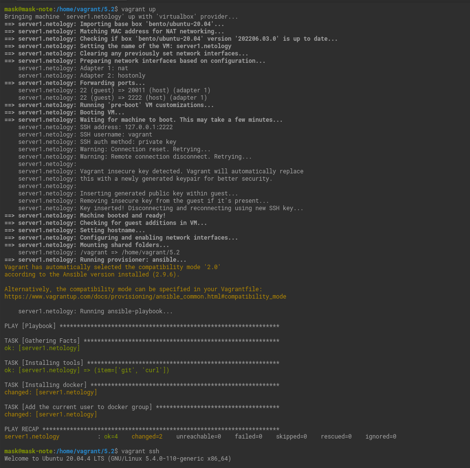
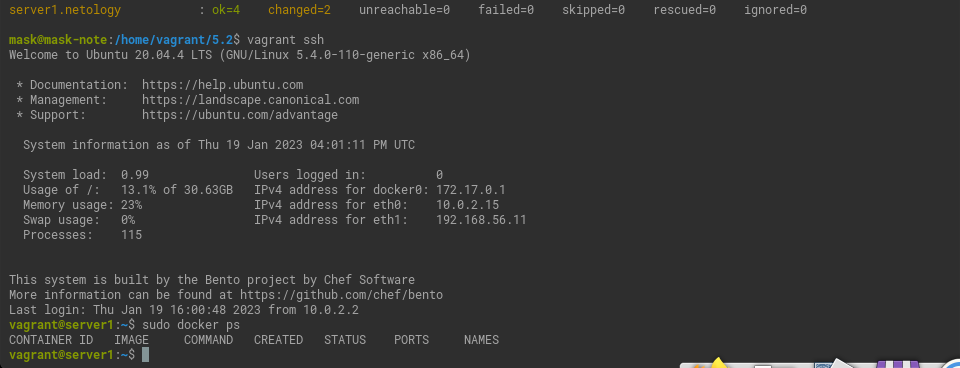

# Домашнее задание к занятию "2. Применение принципов IaaC в работе с виртуальными машинами"

## Как сдавать задания

Обязательными к выполнению являются задачи без указания звездочки. Их выполнение необходимо для получения зачета и диплома о профессиональной переподготовке.

Задачи со звездочкой (*) являются дополнительными задачами и/или задачами повышенной сложности. Они не являются обязательными к выполнению, но помогут вам глубже понять тему.

Домашнее задание выполните в файле readme.md в github репозитории. В личном кабинете отправьте на проверку ссылку на .md-файл в вашем репозитории.

Любые вопросы по решению задач задавайте в чате учебной группы.

---


## Важно!

Перед отправкой работы на проверку удаляйте неиспользуемые ресурсы.
Это важно для того, чтоб предупредить неконтролируемый расход средств, полученных в результате использования промокода.

Подробные рекомендации [здесь](https://github.com/netology-code/virt-homeworks/blob/virt-11/r/README.md)

---

## Задача 1

- Опишите своими словами основные преимущества применения на практике IaaC паттернов.
  
  Скорость и уменьшение затрат производства и вывода продукта на рынок. 
  Стабильность среды, устранение дрейфа конфигураций, масштабируемость и стандартизация.
  Автодокументация (Можно версионировать). 
  Восстановление в аварийных ситуациях.


- Какой из принципов IaaC является основополагающим?

  Идемпотентность.
  
## Задача 2

- Чем Ansible выгодно отличается от других систем управление конфигурациями?

  Низкий порог входа.
  Не требует установки агентов.
  Быстрый старт на существующей ssh-инфраструктуре.
  Декларативный метод написания конфигураций.
  Расширяемость.
    

- Какой, на ваш взгляд, метод работы систем конфигурации более надёжный push или pull?

  Push позволяет контролировать доставку конфигурации и её применение в процессе исполнения.
  Для pull нужны клиенты, что не гарантирует доставку и  применение при сбое клиента и
  накладывает дополнительные затраты на мониторинг применения конфигурации.

## Задача 3

Установить на личный компьютер:

- VirtualBox
- Vagrant
- Ansible

*Приложить вывод команд установленных версий каждой из программ, оформленный в markdown.*
```bash
mask@mask-note:~$ virtualbox --help | head -n 1
Oracle VM VirtualBox VM Selector v6.1.42
mask@mask-note:~$ vagrant -v
Vagrant 2.2.6
mask@mask-note:~$ ansible --version | head -n 1
ansible 2.9.6
mask@mask-note:~$ 

```
## Задача 4 (*)

Воспроизвести практическую часть лекции самостоятельно.

- Создать виртуальную машину.
- Зайти внутрь ВМ, убедиться, что Docker установлен с помощью команды
```
docker ps
```


