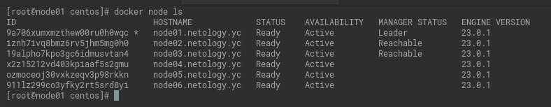
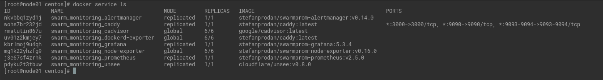
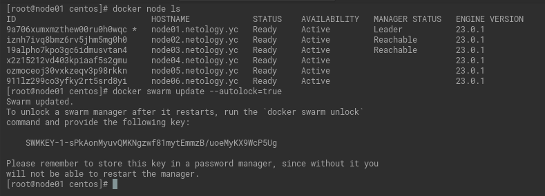

# Домашнее задание к занятию "5. Оркестрация кластером Docker контейнеров на примере Docker Swarm"

## Как сдавать задания

Обязательными к выполнению являются задачи без указания звездочки. Их выполнение необходимо для получения зачета и диплома о профессиональной переподготовке.

Задачи со звездочкой (*) являются дополнительными задачами и/или задачами повышенной сложности. Они не являются обязательными к выполнению, но помогут вам глубже понять тему.

Домашнее задание выполните в файле readme.md в github репозитории. В личном кабинете отправьте на проверку ссылку на .md-файл в вашем репозитории.

Любые вопросы по решению задач задавайте в чате учебной группы.

---


## Важно!

1. Перед отправкой работы на проверку удаляйте неиспользуемые ресурсы.
Это важно для того, чтоб предупредить неконтролируемый расход средств, полученных в результате использования промокода.
Подробные рекомендации [здесь](https://github.com/netology-code/virt-homeworks/blob/virt-11/r/README.md).

2. [Ссылки для установки открытого ПО](https://github.com/netology-code/devops-materials/blob/master/README.md)

---

## Задача 1

Дайте письменые ответы на следующие вопросы:

- В чём отличие режимов работы сервисов в Docker Swarm кластере: replication и global?
  
  `global` - означает, что сервис будет запущен в одном экземпляре на всех нодах.

   `replication` - в данном случае мы сами определяем количество реплик.
  

- Какой алгоритм выбора лидера используется в Docker Swarm кластере?
  
  Алгоритм поддержания распределенного консенсуса - [Raft](http://thesecretlivesofdata.com/raft/).

  
- Что такое Overlay Network?
 
  [Распределенная сеть](https://docs.docker.com/network/) среди нескольких хостов Docker.
  Эта сеть располагается поверх (перекрывает) сети, специфичные для хоста,
  позволяя подключенным к ней контейнерам (включая служебные контейнеры swarm)
  безопасно обмениваться данными при включенном шифровании.
  Docker прозрачно обрабатывает маршрутизацию каждого пакета к правильному хосту Docker
  и правильному контейнеру назначения и обратно.

## Задача 2

Создать ваш первый Docker Swarm кластер в Яндекс.Облаке

Для получения зачета, вам необходимо предоставить скриншот из терминала (консоли), с выводом команды:
```
docker node ls
```



## Задача 3

Создать ваш первый, готовый к боевой эксплуатации кластер мониторинга, состоящий из стека микросервисов.

Для получения зачета, вам необходимо предоставить скриншот из терминала (консоли), с выводом команды:
```
docker service ls
```



## Задача 4 (*)

Выполнить на лидере Docker Swarm кластера команду (указанную ниже) и дать письменное описание её функционала, что она делает и зачем она нужна:
```
# см.документацию: https://docs.docker.com/engine/swarm/swarm_manager_locking/
docker swarm update --autolock=true
```



Включается защита общего ключа шифрования TLS и ключа,
используемого для шифрования и расшифровки журналов Raft в состоянии покоя,
позволяя вам стать владельцем этих ключей и требовать ручной разблокировки ваших менеджеров.
Эта функция называется автоблокировкой.
При перезапуске Docker, вы должны сначала разблокировать Swarm,
используя ключ шифрования, сгенерированный Docker, когда Swarm был заблокирован.

