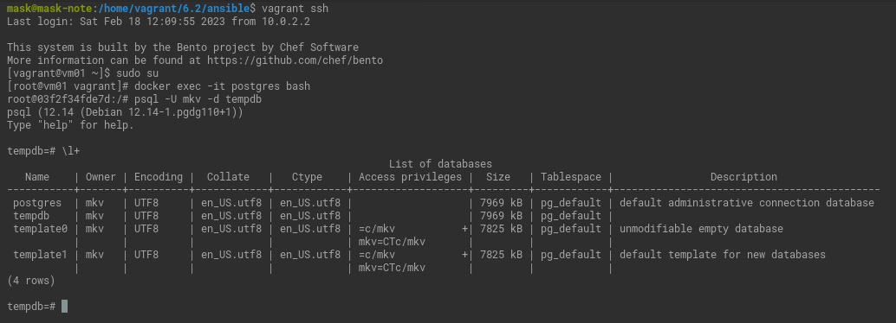
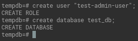
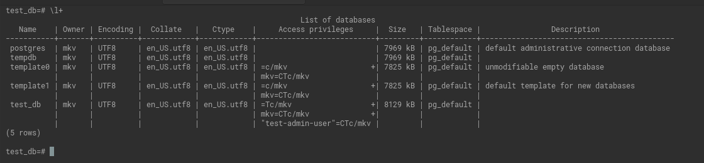
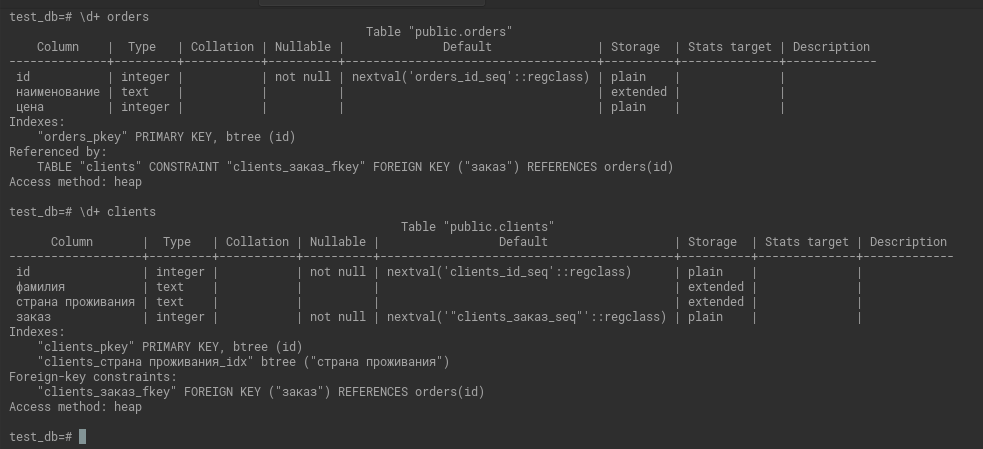
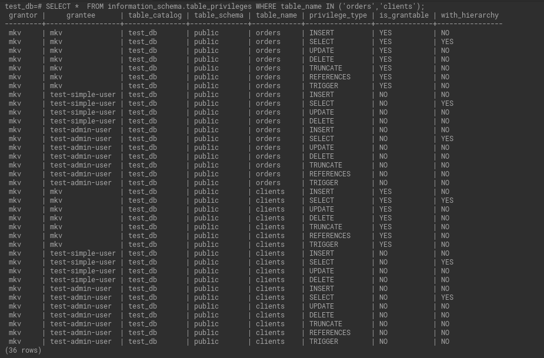
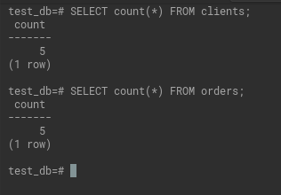
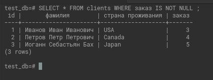
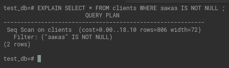
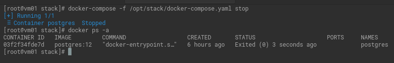
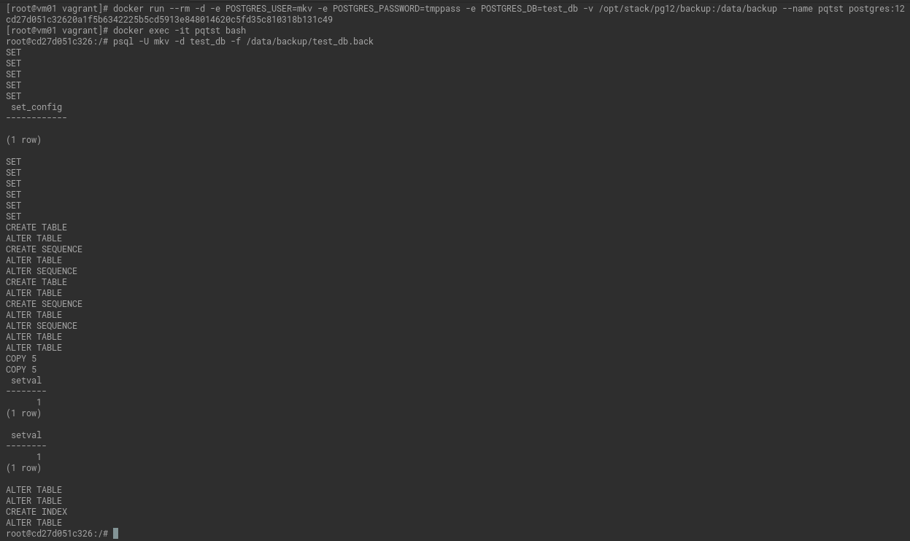

# Домашнее задание к занятию "2. SQL"

## Введение

Перед выполнением задания вы можете ознакомиться с 
[дополнительными материалами](https://github.com/netology-code/virt-homeworks/blob/virt-11/additional/README.md).

## Задача 1

Используя docker поднимите инстанс PostgreSQL (версию 12) c 2 volume, 
в который будут складываться данные БД и бэкапы.

Приведите получившуюся команду или docker-compose манифест.

[Файл](6.2/stack/docker-compose.yaml)

```commandline
vagrant ssh
sudo su 
docker exec -it postgres bash
psql -U mkv -d tempdb
\l+
```


## Задача 2

В БД из задачи 1: 
- создайте пользователя test-admin-user и БД test_db
```commandline
create user "test-admin-user";
create database test_db;
```
  


- в БД test_db создайте таблицу orders и clients (спeцификация таблиц ниже)

```commandline
 CREATE TABLE orders (
id SERIAL PRIMARY KEY,
наименование TEXT,
цена INTEGER
);

CREATE TABLE clients (
id SERIAL PRIMARY KEY,
фамилия TEXT,
"страна проживания" TEXT,
заказ integer,
FOREIGN KEY (заказ) REFERENCES orders
);

CREATE INDEX ON clients("страна проживания");
```

- предоставьте привилегии на все операции пользователю test-admin-user на таблицы БД test_db
```commandline
GRANT ALL ON TABLE orders,clients TO "test-admin-user";
```
- создайте пользователя test-simple-user  

```
create user "test-simple-user";
```
- предоставьте пользователю test-simple-user права на SELECT/INSERT/UPDATE/DELETE данных таблиц БД test_db

```commandline
GRANT SELECT, INSERT, UPDATE, DELETE ON  orders,clients to "test-simple-user";
```


Таблица orders:
- id (serial primary key)
- наименование (string)
- цена (integer)

Таблица clients:
- id (serial primary key)
- фамилия (string)
- страна проживания (string, index)
- заказ (foreign key orders)

Приведите:
- итоговый список БД после выполнения пунктов выше,



- описание таблиц (describe)



- SQL-запрос для выдачи списка пользователей с правами над таблицами test_db

```commandline
SELECT *  FROM information_schema.table_privileges WHERE table_name IN ('orders','clients');
```


- список пользователей с правами над таблицами test_db



## Задача 3

Используя SQL синтаксис - наполните таблицы следующими тестовыми данными:

Таблица orders

|Наименование|цена|
|------------|----|
|Шоколад| 10 |
|Принтер| 3000 |
|Книга| 500 |
|Монитор| 7000|
|Гитара| 4000|

```commandline
INSERT INTO orders VALUES (1, 'Шоколад', 10), (2, 'Принтер', 3000), (3, 'Книга', 500), (4, 'Монитор', 7000), (5, 'Гитара', 4000);
```

Таблица clients

|ФИО|Страна проживания|
|------------|----|
|Иванов Иван Иванович| USA |
|Петров Петр Петрович| Canada |
|Иоганн Себастьян Бах| Japan |
|Ронни Джеймс Дио| Russia|
|Ritchie Blackmore| Russia|

```commandline
INSERT INTO clients VALUES (1, 'Иванов Иван Иванович', 'USA'), (2, 'Петров Петр Петрович', 'Canada'), (3, 'Иоганн Себастьян Бах', 'Japan'), (4, 'Ронни Джеймс Дио', 'Russia'), (5, 'Ritchie Blackmore', 'Russia');
```
Используя SQL синтаксис:
- вычислите количество записей для каждой таблицы 
- приведите в ответе:
    - запросы 
```
SELECT COUNT (*) FROM orders;
SELECT COUNT (*) FROM clients;
```

 - результаты их выполнения.



   

## Задача 4

Часть пользователей из таблицы clients решили оформить заказы из таблицы orders.

Используя foreign keys свяжите записи из таблиц, согласно таблице:

|ФИО|Заказ|
|------------|----|
|Иванов Иван Иванович| Книга |
|Петров Петр Петрович| Монитор |
|Иоганн Себастьян Бах| Гитара |

Приведите SQL-запросы для выполнения данных операций.
```commandline
UPDATE clients SET заказ=(select id from orders where наименование='Книга') WHERE фамилия='Иванов Иван Иванович';
UPDATE clients SET заказ=(select id from orders where наименование='Монитор') WHERE фамилия='Петров Петр Петрович';
UPDATE clients SET заказ=(select id from orders where наименование='Гитара') WHERE фамилия='Иоганн Себастьян Бах';
```

Приведите SQL-запрос для выдачи всех пользователей, которые совершили заказ, а также вывод данного запроса.

```commandline
SELECT * FROM clients WHERE заказ IS NOT NULL ;
```



Подсказка - используйте директиву `UPDATE`.

## Задача 5

Получите полную информацию по выполнению запроса выдачи всех пользователей из задачи 4 
(используя директиву EXPLAIN).

<details>
	<summary>Подсказка для меня.</summary>
     Дополнительный материал.

<https://habr.com/ru/post/203320>

</details>

Приведите получившийся результат и объясните что значат полученные значения.

```commandline
EXPLAIN SELECT * FROM clients WHERE заказ IS NOT NULL ;
```



Seq Scan — последовательное, блок за блоком, чтение данных таблицы `clients`.

`cost` - Планируемые затраты на операцию. 

0.00 — затраты на получение первой строки.
18.10 -— затраты на получение всех строк.

rows — приблизительное количество возвращаемых строк при выполнении операции Seq Scan. 
Это значение возвращает планировщик.

width — средний размер одной строки в байтах.

## Задача 6

Создайте бэкап БД test_db и поместите его в volume, предназначенный для бэкапов (см. Задачу 1).

`pg_dump -U mkv test_db > /data/backup/test_db.back`

Остановите контейнер с PostgreSQL (но не удаляйте volumes).

`docker-compose -f /opt/stack/docker-compose.yaml stop`

  

Поднимите новый пустой контейнер с PostgreSQL.

```commandline
docker run --rm -d -e POSTGRES_USER=mkv -e POSTGRES_PASSWORD=tmppass -e POSTGRES_DB=test_db -v /opt/stack/pg12/backup:/data/backup --name pqtst postgres:12
```


Восстановите БД test_db в новом контейнере.

```commandline
docker exec -it pqtst bash
psql -U mkv -d test_db -f /data/backup/test_db.back
```



Приведите список операций, который вы применяли для бэкапа данных и восстановления.

См. выше


---

### Как cдавать задание

Выполненное домашнее задание пришлите ссылкой на .md-файл в вашем репозитории.


---
