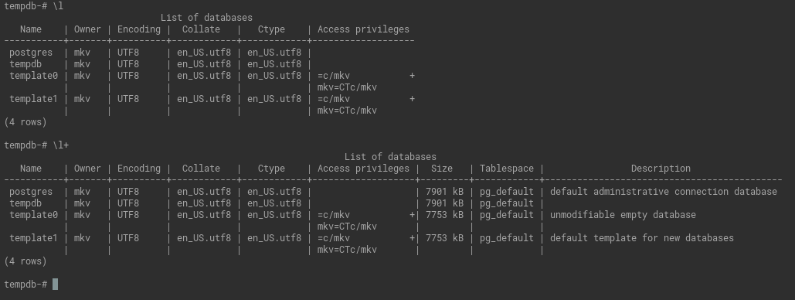
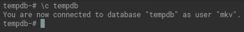
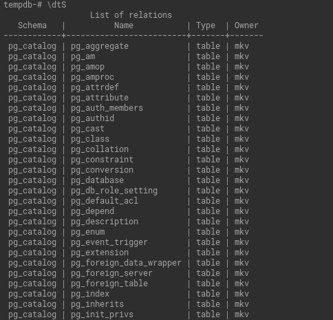
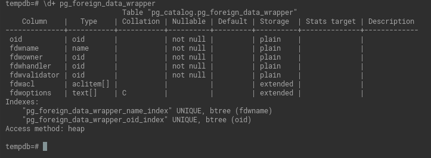
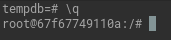
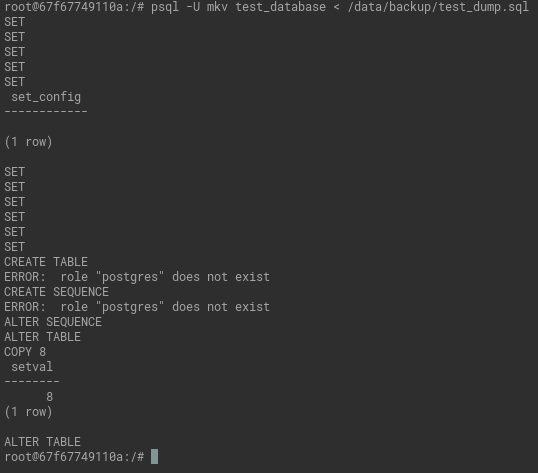
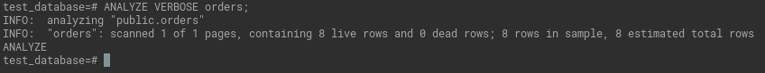
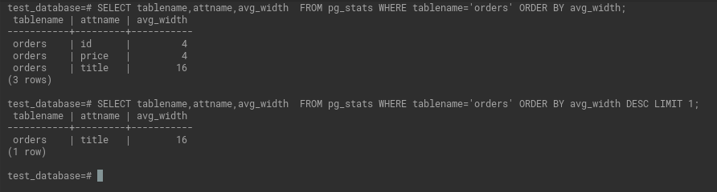

# Домашнее задание к занятию "4. PostgreSQL"

## Задача 1

Используя docker поднимите инстанс PostgreSQL (версию 13). Данные БД сохраните в volume.


Подключитесь к БД PostgreSQL используя `psql`.

```commandline
docker exec -it postgres bash
psql -U mkv -d tempdb
```

Воспользуйтесь командой `\?` для вывода подсказки по имеющимся в `psql` управляющим командам.

**Найдите и приведите** управляющие команды для:
- вывода списка БД

  ` \l[+]   [PATTERN]      list databases`

<details>
<summary>Вывод</summary>

  

</details>
  

- подключения к БД

```commandline
  \c[onnect] {[DBNAME|- USER|- HOST|- PORT|-] | conninfo}
                         connect to new database (currently "tempdb")
```

<details>
<summary>Вывод</summary>

  

</details>

- вывода списка таблиц

```commandline
  \dt[S+] [PATTERN]      list tables
```

<details>
<summary>Вывод</summary>

  

</details>

- вывода описания содержимого таблиц

```\d[S+]  NAME           describe table, view, sequence, or index```

<details>
<summary>Вывод</summary>

  

</details>

- выхода из psql

`\q                     quit psql`

<details>
<summary>Вывод</summary>

  

</details>

## Задача 2

Используя `psql` создайте БД `test_database`.

`psql -U mkv tempdb -c "CREATE DATABASE test_database;"`

<details>
<summary>Вывод</summary>

  

</details>

Изучите [бэкап БД](https://github.com/netology-code/virt-homeworks/tree/virt-11/06-db-04-postgresql/test_data).

Восстановите бэкап БД в `test_database`.

`psql -U mkv test_database < /data/backup/test_dump.sql `

<details>
<summary>Вывод</summary>

  

</details>


Перейдите в управляющую консоль `psql` внутри контейнера.

Подключитесь к восстановленной БД и проведите операцию ANALYZE для сбора статистики по таблице.

```commandline
psql -U mkv test_database
ANALYZE VERBOSE orders;
```
<details>
<summary>Вывод</summary>



</details>

Используя таблицу [pg_stats](https://postgrespro.ru/docs/postgresql/12/view-pg-stats), найдите столбец таблицы `orders` 
с наибольшим средним значением размера элементов в байтах.

**Приведите в ответе** команду, которую вы использовали для вычисления и полученный результат.


```commandline
SELECT tablename,attname,avg_width  FROM pg_stats WHERE tablename='orders' ORDER BY avg_width DESC LIMIT 1;
```
<details>
<summary>Вывод</summary>




</details>

## Задача 3

Архитектор и администратор БД выяснили, что ваша таблица orders разрослась до невиданных размеров и
поиск по ней занимает долгое время. Вам, как успешному выпускнику курсов DevOps в нетологии предложили
провести разбиение таблицы на 2 (шардировать на orders_1 - price>499 и orders_2 - price<=499).

Предложите SQL-транзакцию для проведения данной операции.

```commandline
BEGIN;
CREATE TABLE orders_1 (CHECK (price > 499)) INHERITS (orders);
CREATE TABLE orders_2 (CHECK (price <= 499)) INHERITS (orders);
INSERT INTO orders_1 SELECT * FROM orders WHERE price > 499;
INSERT INTO orders_2 SELECT * FROM orders WHERE price <= 499;
DELETE FROM ONLY orders;
CREATE RULE orders_insert_to_more AS ON INSERT TO orders WHERE ( price > 499 ) DO INSTEAD INSERT INTO orders_1 VALUES (NEW.*);
CREATE RULE orders_insert_to_less AS ON INSERT TO orders WHERE ( price <= 499 ) DO INSTEAD INSERT INTO orders_2 VALUES (NEW.*);
COMMIT;
```


Можно ли было изначально исключить "ручное" разбиение при проектировании таблицы orders?

Да. Добавлением двух последних правил.

## Задача 4

Используя утилиту `pg_dump` создайте бекап БД `test_database`.

`pg_dump -U mkv test_database > /data/backup/test_database_dump.sql`

Как бы вы доработали бэкап-файл, чтобы добавить уникальность значения столбца `title` для таблиц `test_database`?

При создании таблицы добавим ограничение на столбец `UNIQUE (title)`.

````commandline
CREATE TABLE public.orders (
    id integer NOT NULL,
    title character varying(80) NOT NULL,
    price integer DEFAULT 0,
    UNIQUE (title)
);

````

---

### Как cдавать задание

Выполненное домашнее задание пришлите ссылкой на .md-файл в вашем репозитории.

---
