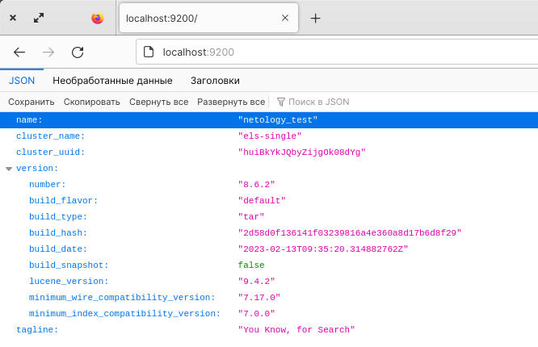
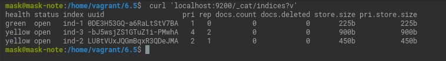
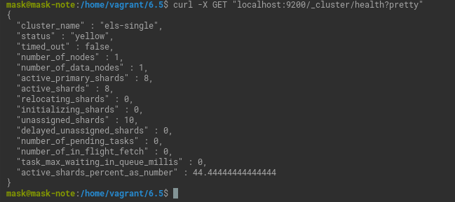
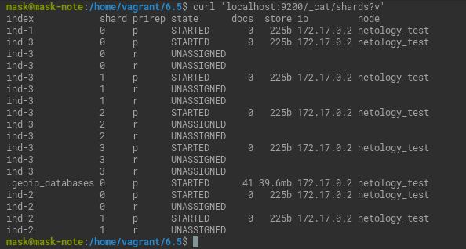
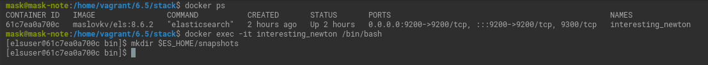
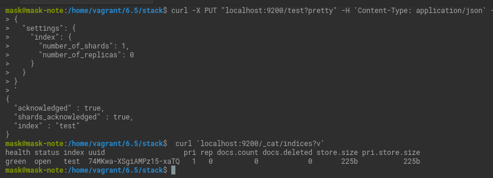
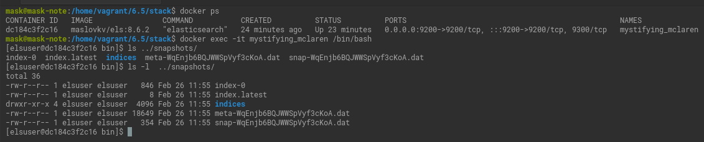
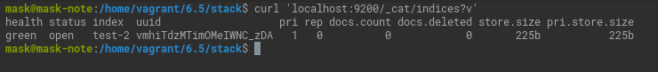
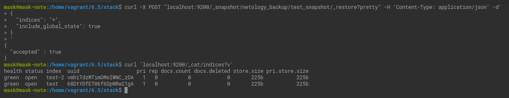

# Домашнее задание к занятию "5. Elasticsearch"

## Задача 1

В этом задании вы потренируетесь в:
- установке elasticsearch
- первоначальном конфигурировании elastcisearch
- запуске elasticsearch в docker

Используя докер образ [centos:7](https://hub.docker.com/_/centos) как базовый и 
[документацию по установке и запуску Elastcisearch](https://www.elastic.co/guide/en/elasticsearch/reference/current/targz.html):

- составьте Dockerfile-манифест для elasticsearch
- соберите docker-образ и сделайте `push` в ваш docker.io репозиторий
- запустите контейнер из получившегося образа и выполните запрос пути `/` c хост-машины

Требования к `elasticsearch.yml`:
- данные `path` должны сохраняться в `/var/lib`
- имя ноды должно быть `netology_test`

В ответе приведите:
- текст Dockerfile манифеста

  [Dockerfile](6.5/Dockerfile)
- ссылку на образ в репозитории dockerhub

  [Ссылка на образ](https://hub.docker.com/repository/docker/maslovkv/els/general)

- ответ `elasticsearch` на запрос пути `/` в json виде
     
  

<details>
<summary>В виде текста.</summary>

```commandline
{
  "name" : "netology_test",
  "cluster_name" : "els-single",
  "cluster_uuid" : "huiBkYkJQbyZijgOk08dYg",
  "version" : {
    "number" : "8.6.2",
    "build_flavor" : "default",
    "build_type" : "tar",
    "build_hash" : "2d58d0f136141f03239816a4e360a8d17b6d8f29",
    "build_date" : "2023-02-13T09:35:20.314882762Z",
    "build_snapshot" : false,
    "lucene_version" : "9.4.2",
    "minimum_wire_compatibility_version" : "7.17.0",
    "minimum_index_compatibility_version" : "7.0.0"
  },
  "tagline" : "You Know, for Search"
}
```

</details>

Подсказки:
- возможно вам понадобится установка пакета perl-Digest-SHA для корректной работы пакета shasum
- при сетевых проблемах внимательно изучите кластерные и сетевые настройки в elasticsearch.yml
- при некоторых проблемах вам поможет docker директива ulimit
- elasticsearch в логах обычно описывает проблему и пути ее решения

Далее мы будем работать с данным экземпляром elasticsearch.

## Задача 2

В этом задании вы научитесь:
- создавать и удалять индексы
- изучать состояние кластера
- обосновывать причину деградации доступности данных

Ознакомтесь с [документацией](https://www.elastic.co/guide/en/elasticsearch/reference/current/indices-create-index.html) 
и добавьте в `elasticsearch` 3 индекса, в соответствии со таблицей:

| Имя | Количество реплик | Количество шард |
|-----|-------------------|-----------------|
| ind-1| 0 | 1 |
| ind-2 | 1 | 2 |
| ind-3 | 2 | 4 |

<details>

```commandline
curl -X PUT "localhost:9200/ind-1?pretty" -H 'Content-Type: application/json' -d'
{
  "settings": {
    "index": {
      "number_of_shards": 1,  
      "number_of_replicas": 0 
    }
  }
}
'
curl -X PUT "localhost:9200/ind-2?pretty" -H 'Content-Type: application/json' -d'
{
  "settings": {
    "index": {
      "number_of_shards": 2,  
      "number_of_replicas": 1 
    }
  }
}
'
curl -X PUT "localhost:9200/ind-3?pretty" -H 'Content-Type: application/json' -d'
{
  "settings": {
    "index": {
      "number_of_shards": 4,  
      "number_of_replicas": 2 
    }
  }
}
'
```

</details>

Получите список индексов и их статусов, используя API и **приведите в ответе** на задание.

```commandline
 curl 'localhost:9200/_cat/indices?v'
```

Получите состояние кластера `elasticsearch`, используя API.

```commandline
curl -X GET "localhost:9200/_cluster/health?pretty"
```



Как вы думаете, почему часть индексов и кластер находится в состоянии yellow?

Часть secondary шард находится в состоянии `UNASSIGNED`. 




Удалите все индексы.
```
for i in ind-1 ind-2 ind-3; do  curl -XDELETE http://localhost:9200/${i}; done
```


**Важно**

При проектировании кластера elasticsearch нужно корректно рассчитывать количество реплик и шард,
иначе возможна потеря данных индексов, вплоть до полной, при деградации системы.

## Задача 3

В данном задании вы научитесь:
- создавать бэкапы данных
- восстанавливать индексы из бэкапов

Создайте директорию `{путь до корневой директории с elasticsearch в образе}/snapshots`.

```commandline
docker ps
docker exec -it interesting_newton /bin/bash
mkdir $ES_HOME/snapshots
```

<details>
<summary>Подробности</summary>



</details>

Используя API [зарегистрируйте](https://www.elastic.co/guide/en/elasticsearch/reference/current/snapshots-register-repository.html#snapshots-register-repository) 
данную директорию как `snapshot repository` c именем `netology_backup`.


**Приведите в ответе** запрос API и результат вызова API для создания репозитория.


```commandline
curl -X PUT "localhost:9200/_snapshot/netology_backup?pretty" -H 'Content-Type: application/json' -d'
{
  "type": "fs",
  "settings": {
    "location": "/opt/elasticsearch/snapshots"
  }
}
'

```


Создайте индекс `test` с 0 реплик и 1 шардом и **приведите в ответе** список индексов.

```commandline
curl -X PUT "localhost:9200/test?pretty" -H 'Content-Type: application/json' -d'
{
  "settings": {
    "index": {
      "number_of_shards": 1,  
      "number_of_replicas": 0 
    }
  }
}
'
 curl 'localhost:9200/_cat/indices?v'
```



[Создайте `snapshot`](https://www.elastic.co/guide/en/elasticsearch/reference/current/snapshots-take-snapshot.html) 
состояния кластера `elasticsearch`.

```commandline
curl -X PUT "localhost:9200/_snapshot/netology_backup/test_snapshot?pretty"
```

**Приведите в ответе** список файлов в директории со `snapshot`ами.



Удалите индекс `test` и создайте индекс `test-2`. **Приведите в ответе** список индексов.

```commandline
curl -XDELETE http://localhost:9200/test
curl -X PUT "localhost:9200/test-2?pretty" -H 'Content-Type: application/json' -d'
{
  "settings": {
    "index": {
      "number_of_shards": 1,  
      "number_of_replicas": 0 
    }
  }
}
'
 curl 'localhost:9200/_cat/indices?v'
```



[Восстановите](https://www.elastic.co/guide/en/elasticsearch/reference/current/snapshots-restore-snapshot.html) состояние
кластера `elasticsearch` из `snapshot`, созданного ранее. 

```commandline
curl -X POST "localhost:9200/_snapshot/netology_backup/test_snapshot/_restore?pretty" -H 'Content-Type: application/json' -d'
{
  "indices": "*",
  "include_global_state": true
}
'
```

**Приведите в ответе** запрос к API восстановления и итоговый список индексов.




Подсказки:
- возможно вам понадобится доработать `elasticsearch.yml` в части директивы `path.repo` и перезапустить `elasticsearch`

 
Добавлена команда 'mkdir /opt/elasticsearch/snapshots' в [Dockerfile](6.5/Dockerfile)
  
и `path.repo: /opt/elasticsearch/snapshots` в `elasticsearch.yml`. Образ пересобран.

---

### Как cдавать задание

Выполненное домашнее задание пришлите ссылкой на .md-файл в вашем репозитории.

---
