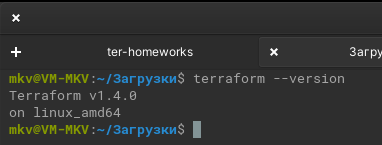
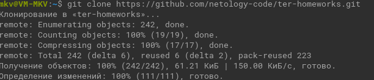
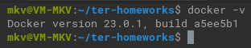
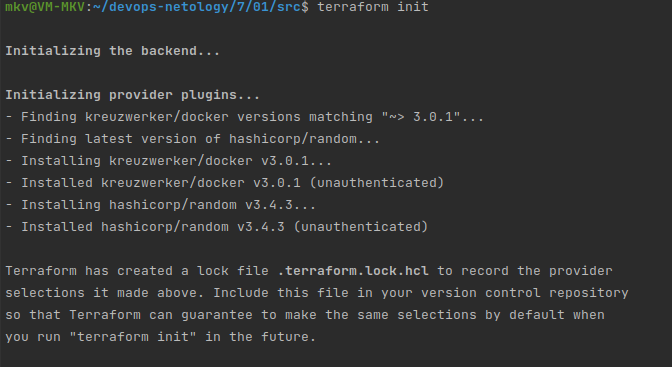
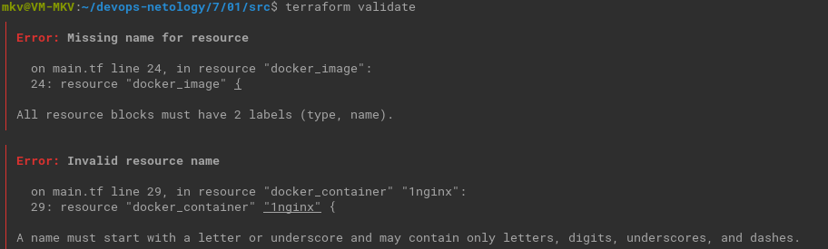
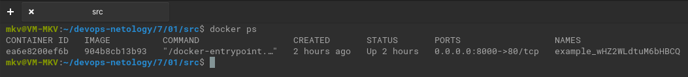
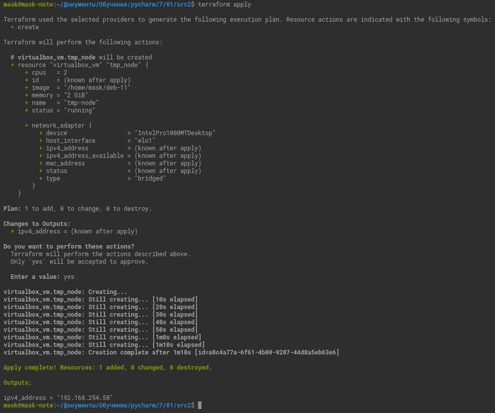

# Домашнее задание к занятию "Введение в Terraform"

### Цель задания

1. Установить и настроить Terrafrom.
2. Научиться использовать готовый код.

------

### Чеклист готовности к домашнему заданию

1. Скачайте и установите актуальную версию **terraform**(не менее 1.3.7). Приложите скриншот вывода команды ```terraform --version```



2. Скачайте на свой ПК данный git репозиторий. Исходный код для выполнения задания расположен в директории **01/src**.



3. Убедитесь, что в вашей ОС установлен docker



------

### Инструменты и дополнительные материалы, которые пригодятся для выполнения задания

1. Установка и настройка Terraform [ссылка](https://cloud.yandex.ru/docs/tutorials/infrastructure-management/terraform-quickstart#from-yc-mirror)
2. Зеркало документации Terraform [ссылка](https://registry.tfpla.net/browse/providers) 
3. Установка docker [ссылка](https://docs.docker.com/engine/install/ubuntu/) 
------

### Задание 1

1. Перейдите в каталог [**src**](https://github.com/netology-code/ter-homeworks/tree/main/01/src). Скачайте все необходимые зависимости, использованные в проекте.

   
   `terraform init`
   
   
   


2. Изучите файл **.gitignore**. В каком terraform файле допустимо сохранить личную, секретную информацию?

   ```personal.auto.tfvars```

3. Выполните код проекта. Найдите в State-файле секретное содержимое созданного ресурса **random_password**. Пришлите его в качестве ответа.

   ```"result": "wHZ2WLdtuM6bHBCQ"```

4. Раскомментируйте блок кода, примерно расположенный на строчках 24-37 файла **main.tf**.
Выполните команду ```terraform validate```. Объясните в чем заключаются намеренно допущенные ошибки? Исправьте их.



* Ошибка в строке 24. Не задано имя ресурса, обязательное в данном блоке.
* Ошибка в строке 29. Неправильно задано имя ресурса. 
Имя должно начинаться с буквы или символа подчеркивания и может содержать только буквы, цифры, символы подчеркивания и тире.

<details><summary>Исправленный код</summary>

```terraform
resource "docker_image" "nginx" {
  name         = "nginx:latest"
  keep_locally = true
}

resource "docker_container" "nginx" {
  image = docker_image.nginx.image_id
  name  = "example_${random_password.random_string.result}"

  ports {
    internal = 80
    external = 8000
  }
}
```

</details>

5. Выполните код. В качестве ответа приложите вывод команды ```docker ps```



6. Замените имя docker-контейнера в блоке кода на ```hello_world```, выполните команду ```terraform apply -auto-approve```.
Объясните своими словами, в чем может быть опасность применения ключа  ```-auto-approve``` ?

Применяет план без его предварительного вывода и подтверждения.

<details><summary></summary>

```
 -auto-approve          Skip interactive approval of plan before applying.
```

</details>

8. Уничтожьте созданные ресурсы с помощью **terraform**. Убедитесь, что все ресурсы удалены. Приложите содержимое файла **terraform.tfstate**. 

<details><summary>Файл.</summary>

```terraform
{
  "version": 4,
  "terraform_version": "1.4.0",
  "serial": 10,
  "lineage": "965495f1-9dfa-3f2a-73cd-e2d3e2083e08",
  "outputs": {},
  "resources": [],
  "check_results": null
}

```
</details>
9. Объясните, почему при этом не был удален docker образ **nginx:latest** ?(Ответ найдите в коде проекта или документации)

Потому, что задан параметр `keep_locally = true`.  
 
<details><summary>Подробности.</summary>

[Тут](https://registry.tfpla.net/providers/kreuzwerker/docker/latest/docs/resources/image)

</details>

------

## Дополнительные задания (со звездочкой*)
Эти задания дополнительные (необязательные к выполнению) и никак не повлияют на получение вами зачета по этому домашнему заданию. Вы можете их выполнить, если хотите глубже и/или шире разобраться в материале.

### Задание 2*

1. Изучите в документации provider [**Virtualbox**](https://registry.tfpla.net/providers/shekeriev/virtualbox/latest/docs/overview/index) от 
shekeriev.
2. Создайте с его помощью любую виртуальную машину.

В качестве ответа приложите output values созданного ресурса.



------

### Правила приема работы

Домашняя работа оформляется в отдельном GitHub репозитории в файле README.md.   
Выполненное домашнее задание пришлите ссылкой на .md-файл в вашем репозитории.

### Критерии оценки

Зачёт:

* выполнены все задания;
* ответы даны в развёрнутой форме;
* приложены соответствующие скриншоты и файлы проекта;
* в выполненных заданиях нет противоречий и нарушения логики.

На доработку:

* задание выполнено частично или не выполнено вообще;
* в логике выполнения заданий есть противоречия и существенные недостатки. 
