# Домашнее задание к занятию "Основы Terraform. Yandex Cloud"

### Цель задания

1. Создать свои ресурсы в облаке Yandex Cloud с помощью Terraform.
2. Освоить работу с переменными Terraform.


### Чек-лист готовности к домашнему заданию

1. Зарегистрирован аккаунт в Yandex Cloud. Использован промокод на грант.
2. Установлен инструмент Yandex Cli.
3. Исходный код для выполнения задания расположен в директории [**02/src**](https://github.com/netology-code/ter-homeworks/tree/main/02/src).


### Подготовка к выполнению домашнего задания

1. Ознакомьтесь с [документацией к security-groups в Yandex Cloud](https://cloud.yandex.ru/docs/vpc/concepts/security-groups?from=int-console-help-center-or-nav).
2. Запросите preview доступ к данному функционалу в ЛК Yandex Cloud. Обычно его выдают в течении 24-х часов.
https://console.cloud.yandex.ru/folders/<ваш cloud_id>/vpc/security-groups


### Задание 1

1. Изучите проект. В файле variables.tf объявлены переменные для yandex provider.
2. Переименуйте файл personal.auto.tfvars_example в personal.auto.tfvars. Заполните переменные (идентификаторы облака, токен доступа). Благодаря .gitignore этот файл не попадет в публичный репозиторий. **Вы можете выбрать иной способ безопасно передать секретные данные в terraform.**
3. Сгенерируйте или используйте свой текущий ssh ключ. Запишите его открытую часть в переменную **vms_ssh_root_key**.
4. Инициализируйте проект, выполните код. Исправьте возникшую ошибку. Ответьте в чем заключается ее суть?
5. Ответьте, что означает ```preemptible = true``` и ```core_fraction``` в параметрах ВМ? Как это может пригодится в процессе обучения? Ответ в документации Yandex cloud.

В качестве решения приложите:
- скриншот ЛК Yandex Cloud с созданной ВМ,

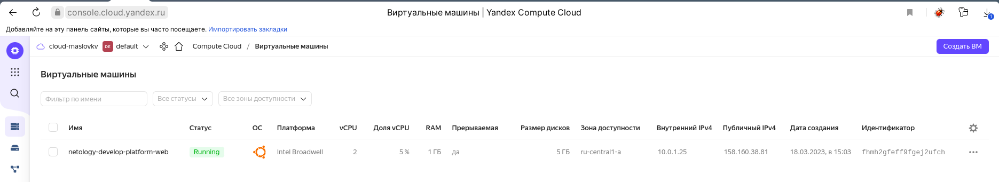

- скриншот успешного подключения к консоли ВМ через ssh,

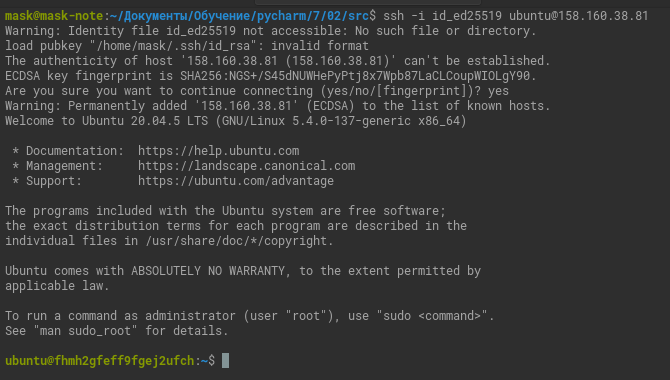

- ответы на вопросы.

<details><summary>
Ошибка указывает на недопустимое количество ядер для платформы <code>standard-v1</code>.
Разрешенное количество ядер 2, 4.


</summary>

```
yandex_compute_instance.platform: Creating...
╷
│ Error: Error while requesting API to create instance: server-request-id = f571067c-045a-481f-bbd7-b61ef0da55ee server-trace-id = 71b75cb7c41a6c29:126449d24af4709b:71b75cb7c41a6c29:1 client-request-id = bdd87e2f-02c9-487a-8dd7-e9e49a201b70 client-trace-id = 44f33324-c3e8-459a-b906-22f30b27ba6c rpc error: code = InvalidArgument desc = the specified number of cores is not available on platform "standard-v1"; allowed core number: 2, 4
│ 
│   with yandex_compute_instance.platform,
│   on main.tf line 15, in resource "yandex_compute_instance" "platform":
│   15: resource "yandex_compute_instance" "platform" {
```

</details>

<details><summary><code>preemptible = true</code> - делает ВМ прерываемой.</summary>

[Подробности](https://cloud.yandex.ru/docs/compute/concepts/preemptible-vm)

</details>


<details><summary><code>core_fraction = 5</code>
- задает уровень производительности процессора ВМ.</summary>

Подробности
[тут](https://cloud.yandex.ru/docs/compute/api-ref/Instance/update) и 
[тут](https://cloud.yandex.ru/docs/compute/concepts/performance-levels).
</details>

<blockquote>Прерываемые виртуальные машины доступны по более низкой цене в сравнении с обычными, однако не обеспечивают отказоустойчивости.
</blockquote>
<blockquote>
ВМ с уровнем производительности меньше 100% предназначены для запуска приложений, не требующих высокой производительности и не чувствительных к задержкам. Такие машины обойдутся дешевле.
</blockquote>


### Задание 2

1. Изучите файлы проекта.
2. Замените все "хардкод" **значения** для ресурсов **yandex_compute_image** и **yandex_compute_instance** на **отдельные** переменные. К названиям переменных ВМ добавьте в начало префикс **vm_web_** .  Пример: **vm_web_name**.
3. Объявите нужные переменные в файле variables.tf, обязательно указывайте тип переменной. Заполните их **default** прежними значениями из main.tf. 
4. Проверьте terraform plan (изменений быть не должно). 

<details><summary> Добавлено </summary>
<code>

```terraform
variable "vm_web_image_family" {
  type        = string
  description = "OS release name"
  default     = "ubuntu-2004-lts"
}

variable "vm_web_name" {
  type        = string
  description = "Name VM"
  default     =  "netology-develop-platform-web"
}

variable "vm_web_platform_id" {
  type        = string
  description = "VM platform_id"
  default     =   "standard-v1"
}

variable "vm_web_cores" {
  type        = number
  description = "VM cores"
  default     =  2
}

variable "vm_web_memory" {
  type        = number
  description = "VM memory"
  default     =  1
}

variable "vm_web_core_fraction" {
  type        = number
  description = "VM core fraction"
  default     =  5
}
``` 
</code>
</details>

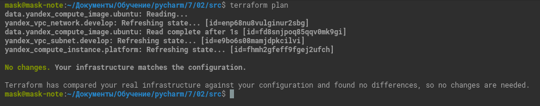
### Задание 3

1. Создайте в корне проекта файл 'vms_platform.tf' . Перенесите в него все переменные ВМ.
2. Скопируйте блок ресурса и создайте с его помощью вторую ВМ: **"netology-develop-platform-db"** ,  cores  = 2, memory = 2, core_fraction = 20. Объявите ее переменные с префиксом **vm_db_** в том же файле.
3. Примените изменения.

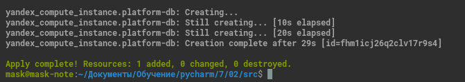


### Задание 4


<details><summary>
1. Объявите в файле outputs.tf отдельные output, для каждой из ВМ с ее внешним IP адресом.</summary>

```terraform
output "external_ip_netology-develop-platform-web" {
  value = "${yandex_compute_instance.platform.network_interface.0.nat_ip_address}"
}
output "external_ip_netology-develop-platform-db" {
  value = "${yandex_compute_instance.platform-db.network_interface.0.nat_ip_address}"
```

</details>

2. Примените изменения.

В качестве решения приложите вывод значений ip-адресов команды ```terraform output```

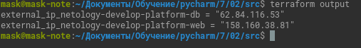

### Задание 5

<details><summary>1. В файле locals.tf опишите в **одном** local-блоке имя каждой ВМ, используйте интерполяцию по примеру из лекции.</summary>

```terraform
locals {
  db-name="netology-${var.vpc_name}-platform-db"
  web-name="netology-${var.vpc_name}-platform-web"
}
```

</details>

<details><summary>2. Замените переменные с именами ВМ из файла variables.tf на созданные вами local переменные.</summary>

```terraform
resource "yandex_compute_instance" "platform" {
  name = local.web-name
  ...
}
resource "yandex_compute_instance" "platform-db" {
  name = local.db-name
  ...
}
```

</details>


<details><summary>3. Примените изменения.</summary>

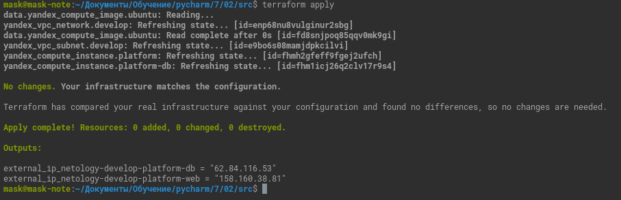

</details>

### Задание 6

<details><summary>
1. Вместо использования 3-х переменных  ".._cores",".._memory",".._core_fraction" в блоке  resources {...}, объедините их в переменные типа **map** с именами "vm_web_resources" и "vm_db_resources".
</summary>

```terraform
resource "yandex_compute_instance" "platform" {
  name        = local.web-name
  platform_id = var.vm_platform_id
  resources {
    cores         = var.vm_web_resources.cores
    memory        = var.vm_web_resources.memory
    core_fraction = var.vm_web_resources.core_fraction
  }

  boot_disk {
    initialize_params {
      image_id = data.yandex_compute_image.ubuntu.image_id
    }
  }
  scheduling_policy {
    preemptible = true
  }
  network_interface {
    subnet_id = yandex_vpc_subnet.develop.id
    nat       = true
  }

  metadata = {
    serial-port-enable = 1
    ssh-keys           = "ubuntu:${var.vm_ssh_root_key}"
  }

}

resource "yandex_compute_instance" "platform-db" {
  name        = local.db-name
  platform_id = var.vm_platform_id
  resources {
    cores         = var.vm_db_resources.cores
    memory        = var.vm_db_resources.memory
    core_fraction = var.vm_db_resources.core_fraction
  }
  boot_disk {
    initialize_params {
      image_id = data.yandex_compute_image.ubuntu.image_id
    }
  }
  scheduling_policy {
    preemptible = true
  }
  network_interface {
    subnet_id = yandex_vpc_subnet.develop.id
    nat       = true
  }

  metadata = {
    serial-port-enable = 1
    ssh-keys           = "ubuntu:${var.vm_ssh_root_key}"
  }

}
```

```terraform
variable "vm_web_resources" {
  type = map
  default = {
    cores = 2
    memory = 1
    core_fraction = 5
  }
}
variable "vm_db_resources" {
  type = map
  default = {
    cores = 2
    memory = 2
    core_fraction = 20
  }
}

```

</details>

<details><summary>
2. Так же поступите с блоком **metadata {serial-port-enable, ssh-keys}**, эта переменная должна быть общая для всех ваших ВМ.
</summary>

```terraform
variable "vm_metadata" {
  type = map
  default = {
    serial-port-enable = 1
    ssh-keys           = "ubuntu:ssh-ed25519 AAAAC3NzaC1lZDI1NTE5AAAAIP/ADybrpsPKe8bXTSBsxXOuhqq4rA9FvLXUPrUiy7hT mask@mask-note" 
  }
}
```
```terraform
metadata = {
    serial-port-enable = var.vm_metadata.serial-port-enable
    ssh-keys           = var.vm_metadata.ssh-keys
  }

```
</details>

3. Найдите и удалите все более не используемые переменные проекта.
4. Проверьте terraform plan (изменений быть не должно).

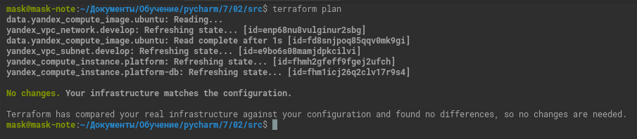
------

## Дополнительные задания (со звездочкой*)

**Настоятельно рекомендуем выполнять все задания под звёздочкой.**  Их выполнение поможет глубже разобраться в материале.   
Задания под звёздочкой дополнительные (необязательные к выполнению) и никак не повлияют на получение вами зачета по этому домашнему заданию. 

### Задание 7*

Изучите содержимое файла console.tf. Откройте terraform console, выполните следующие задания: 

1. Напишите, какой командой можно отобразить **второй** элемент списка test_list?

`local.test_list[1]`

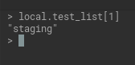

2. Найдите длину списка test_list с помощью функции length(<имя переменной>).

`length(local.test_list)`

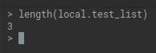

3. Напишите, какой командой можно отобразить значение ключа admin из map test_map ?

`local.test_map.admin`

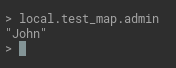

4. Напишите interpolation выражение, результатом которого будет: "John is admin for production server based on OS ubuntu-20-04 with X vcpu, Y ram and Z virtual disks", используйте данные из переменных test_list, test_map, servers и функцию length() для подстановки значений.

`"${local.test_map.admin} is admin for ${local.test_list[2]} server based on OS ${local.servers.production.image} with ${local.servers.production.cpu} vcpu, ${local.servers.production.ram} ram and ${length(local.servers.production.disks)} virtual disks."`

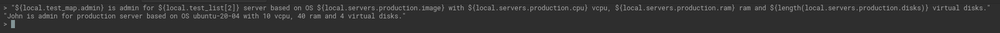

В качестве решения предоставьте необходимые команды и их вывод.

------
### Правила приема работы

В git-репозитории, в котором было выполнено задание к занятию "Введение в Terraform", создайте новую ветку terraform-02, закомитьте в эту ветку свой финальный код проекта. Ответы на задания и необходимые скриншоты оформите в md-файле в ветке terraform-02.

В качестве результата прикрепите ссылку на ветку terraform-02 в вашем репозитории.

**ВАЖНО! Удалите все созданные ресурсы**.


### Критерии оценки

Зачёт:

* выполнены все задания;
* ответы даны в развёрнутой форме;
* приложены соответствующие скриншоты и файлы проекта;
* в выполненных заданиях нет противоречий и нарушения логики.

На доработку:

* задание выполнено частично или не выполнено вообще;
* в логике выполнения заданий есть противоречия и существенные недостатки. 
